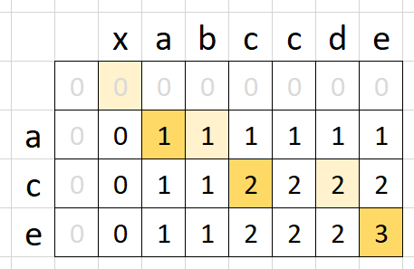
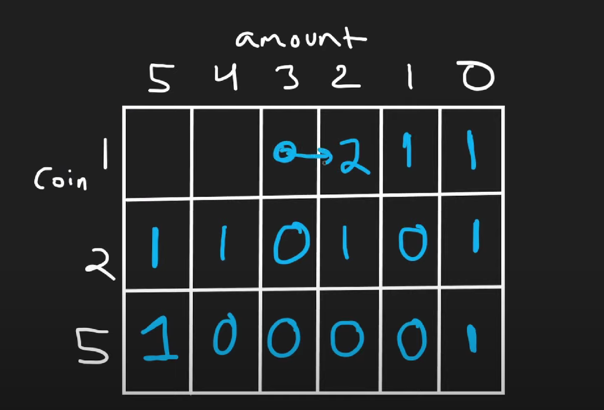

# 2-D Dynamic Programming

The key for dp is to find the variables to represent the states and deduce the transition function.

## [Unique Paths](https://leetcode.com/problems/unique-paths)

A: 每个方格的路径数目取决于其上边和左边方格的路径数目，注意越界检查。

```cpp
class Solution {
public:
    int uniquePaths(int m, int n) {
        vector<vector<int>> dp(m, vector<int>(n, 0));
        dp[0][0] = 1;

        for (int i = 0; i < m; i++) {
            for (int j = 0; j < n; j++) {
                if (i - 1 >= 0) {
                    dp[i][j] += dp[i-1][j];
                }
                if (j - 1 >= 0) {
                    dp[i][j] += dp[i][j-1];
                }
            }
        }

        return dp[m-1][n-1];
    }
};
```

A: 可以省略二维数组，只用一维数组存储当前行的数据。

```go
func uniquePaths(m int, n int) int {
    if m == 1 || n == 1 {
        return 1
    }
    pre := make([]int, n)
    cur := make([]int, n)
    for i := 1; i < n; i++ {
        pre[i] = 1
    }
    for i := 1; i < m; i++ {
        cur[0] = 1
        for j := 1; j < n; j++ {
            cur[j] = pre[j] + cur[j - 1]
        }
        tmp := make([]int, n)
        copy(tmp, cur)
        pre = tmp
    }
    return pre[n - 1]
}
```

## [Longest Common Subsequence](https://leetcode.com/problems/longest-common-subsequence)

A: 两个字符串组成grid，`grid[i][j]`按当前字母是否匹配，分别取对角线，或者上方和左方网格最大值。



```cpp
class Solution {
public:
    int longestCommonSubsequence(string text1, string text2) {
        int len1 = text1.length(), len2 = text2.length();
        // 优化内存，只存网格中的一行数据。
        int cur_val, pre_val;
        vector<int> dp(len2+1, 0);
        for(int i=1;i<=len1;++i) {
            pre_val = 0;
            for(int j=1;j<=len2;++j) {
                cur_val = dp[j];
                dp[j] = max({dp[j], dp[j-1], pre_val + (text1[i-1]==text2[j-1])});
                pre_val = cur_val;
            }
        }
        return dp[len2];
    }

};
```

```go
func longestCommonSubsequence(text1 string, text2 string) int {
	t1 := len(text1)
	t2 := len(text2)
	dp:=make([][]int,t1+1)
	for i:=range dp{
		dp[i]=make([]int,t2+1)
	}

	for i := 1; i <= t1; i++ {
		for j := 1; j <=t2; j++ {
			if text1[i-1]==text2[j-1]{
				dp[i][j]=dp[i-1][j-1]+1
			}else{
				dp[i][j]=max(dp[i-1][j],dp[i][j-1])
			}
		}
	}
	return dp[t1][t2]
}

func max(a,b int)int  {
	if a>b{
		return a
	}
	return b
}
```

## [Uncrossed Lines](https://leetcode.com/problems/uncrossed-lines)

A: 同上一题，只是求的是最大匹配数。

```go
func maxUncrossedLines(nums1 []int, nums2 []int) int {
    m, n := len(nums2) + 1, len(nums1) + 1
    pre := make([]int, n)
    cur := make([]int, n)
    for i := 1; i < m; i++ {
        for j := 1; j < n; j++ {
            if nums2[i - 1] == nums1[j - 1] {
                cur[j] = pre[j - 1] + 1
            } else {
                cur[j] = max(pre[j], cur[j - 1])
            }
        }
        tmp := make([]int, n)
        copy(tmp, cur)
        pre = tmp
    }
    return pre[n - 1]
}

func max(i, j int) int {
    if i < j {
        return j
    } else {
        return i
    }
}
```

## [Best Time to Buy And Sell Stock With Cooldown](https://leetcode.com/problems/best-time-to-buy-and-sell-stock-with-cooldown)

A: DP + 状态机（卖、持有、cd）。

[详解](https://leetcode.com/problems/best-time-to-buy-and-sell-stock-with-cooldown/solutions/75927/share-my-thinking-process/?orderBy=most_votes)

```cpp
int maxProfit(vector<int> &prices) {
    int buy(INT_MIN), sell(0), prev_sell(0), prev_buy;
    for (int price : prices) {
        prev_buy = buy;
        buy = max(prev_sell - price, buy);
        prev_sell = sell;
        sell = max(prev_buy + price, sell);
    }
    return sell;
}
```

```go
func maxProfit(prices []int) int {
    prevSell, prevBuy, sell, buy := 0, 0, 0, math.MinInt
    for _, p := range prices {
        prevBuy = buy
        buy = max(prevSell - p, buy)
        prevSell = sell
        sell = max(prevBuy + p, sell)
    }
    return sell
}

func max(i, j int) int {
    if i > j {
        return i
    } else {
        return j
    }
}
```

## [Coin Change II](https://leetcode.com/problems/coin-change-ii)

A: 填表，每个方格`dp[coin][amount]`为使用从当前coin到列尾所有coin时，集齐amount的方法数。



```cpp
class Solution {
public:
    int change(int amount, vector<int>& coins) {
        return dfs(amount, coins, 0, 0);
    }
private:
    // {(index, sum) -> # of combos that make up this amount}
    map<pair<int, int>, int> dp;
    
    int dfs(int amount, vector<int>& coins, int i, int sum) {
        if (sum == amount) {
            return 1;
        }
        if (sum > amount) {
            return 0;
        }
        if (i == coins.size()) {
            return 0;
        }
        if (dp.find({i, sum}) != dp.end()) {
            return dp[{i, sum}];
        }
        
        dp[{i, sum}] = dfs(amount, coins, i, sum + coins[i])
                     + dfs(amount, coins, i + 1, sum);
        
        return dp[{i, sum}];
    }
};
```

A: 完全背包问题。
```go
func change(amount int, coins []int) int {
    dp := make([]int, amount + 1)
    dp[0] = 1
    for i := 0; i < len(coins); i++ {
        for j := i; j < len(dp); j++ {
            if j - coins[i] >= 0 {
                dp[j] += dp[j - coins[i]]
            }
        }
    }
    return dp[amount]
}
```

## [Target Sum](https://leetcode.com/problems/target-sum)

A: DP。

```cpp
class Solution {
public:
    int findTargetSumWays(vector<int>& nums, int target) {
        return backtrack(nums, target, 0, 0);
    }
private:
    // {(index, total) -> # of ways}
    map<pair<int, int>, int> dp;
    
    int backtrack(vector<int>& nums, int target, int i, int total) {
        if (i == nums.size()) {
            return total == target ? 1 : 0;
        }
        if (dp.find({i, total}) != dp.end()) {
            return dp[{i, total}];
        }
        
        dp[{i, total}] = backtrack(nums, target, i + 1, total + nums[i])
                       + backtrack(nums, target, i + 1, total - nums[i]);
        
        return dp[{i, total}];
    }
};
```

A: 01背包问题。

```go
func findTargetSumWays(nums []int, target int) int {
	sum := 0
	for _, v := range nums {
		sum += v
	}
	if abs(target) > sum {
		return 0
	}
	if (sum+target)%2 == 1 {
		return 0
	}
	// 计算背包大小：需要满足bag + (sum - bag) = target
	bag := (sum + target) / 2
	// 定义dp数组
	dp := make([]int, bag+1)
	// 初始化
	dp[0] = 1
	// 遍历顺序
	for i := 0; i < len(nums); i++ {
		for j := bag; j >= nums[i]; j-- {
			//推导公式：组合问题，dp[j]代表组合为j有几种方法。
			dp[j] += dp[j-nums[i]]
		}
	}
	return dp[bag]
}

func abs(x int) int {
	return int(math.Abs(float64(x)))
}
```

## [Interleaving String](https://leetcode.com/problems/interleaving-string)

A: cache行列分别为s1、s2。

```cpp
class Solution {
public:
    bool isInterleave(string s1, string s2, string s3) {
        if (s3.size() != s1.size() + s2.size()) {
            return false;
        }
        return dfs(s1, s2, s3, 0, 0);
    }
private:
    map<pair<int, int>, bool> dp; // s1, s2, isInterleave
    
    bool dfs(string s1, string s2, string s3, int i, int j) {
        if (i == s1.size() && j == s2.size()) {
            return true;
        }
        if (dp.find({i, j}) != dp.end()) {
            return dp[{i, j}];
        }
        
        if (i < s1.size() && s1[i] == s3[i + j] && dfs(s1, s2, s3, i + 1, j)) {
            return true;
        }
        if (j < s2.size() && s2[j] == s3[i + j] && dfs(s1, s2, s3, i, j + 1)) {
            return true;
        }
        
        dp[{i, j}] = false;
        return dp[{i, j}];
    }
};
```

## [Longest Increasing Path In a Matrix](https://leetcode.com/problems/longest-increasing-path-in-a-matrix)

A: `map<pair<int, int>, int>`存储已知结果。

```cpp
class Solution {
public:
    int longestIncreasingPath(vector<vector<int>>& matrix) {
        int m = matrix.size();
        int n = matrix[0].size();
        
        int result = 0;
        
        for (int i = 0; i < m; i++) {
            for (int j = 0; j < n; j++) {
                result = max(result, dfs(matrix, -1, i, j, m, n));
            }
        }
        
        return result;
    }
private:
    // {(i, j) -> longest increasing path at (i, j)}
    map<pair<int, int>, int> dp;
    
    int dfs(vector<vector<int>>& matrix, int prev, int i, int j, int m, int n) {
        if (i < 0 || i >= m || j < 0 || j >= n || matrix[i][j] <= prev) {
            return 0;
        }
        if (dp.find({i, j}) != dp.end()) {
            return dp[{i, j}];
        }
        
        int result = 1;
        result = max(result, 1 + dfs(matrix, matrix[i][j], i - 1, j, m, n));
        result = max(result, 1 + dfs(matrix, matrix[i][j], i + 1, j, m, n));
        result = max(result, 1 + dfs(matrix, matrix[i][j], i, j - 1, m, n));
        result = max(result, 1 + dfs(matrix, matrix[i][j], i, j + 1, m, n));
        dp[{i, j}] = result;
        
        return dp[{i, j}];
    }
};
```

## [Distinct Subsequences](https://leetcode.com/problems/distinct-subsequences)

A: 填表，两种情况分别取下一行或下一行值与右下角值之和。

```cpp
class Solution {
public:
    int numDistinct(string s, string t) {
        unsigned int cur;
        vector<unsigned int> pre(t.size() + 1, 0);
        pre[t.size()] = 1;
        for (int i = s.size() - 1; i >= 0; i--) {
            cur = 1;
            for(int j = t.size() - 1; j >= 0; j--) {
                unsigned int tmp = pre[j] + (s[i] == t[j] ? pre[j + 1] : 0);
                pre[j + 1] = cur;
                cur = tmp;
            }
            pre[0] = cur;
        }
        return cur;
    }
};
```

```go
func numDistinct(s string, t string) int {
    if len(t) > len(s) {
        return 0
    }
    pre := make([]int, len(s) + 1)
    for i := range pre {
        pre[i] = 1
    }
    cur := make([]int, len(s) + 1)
    for i := 1; i <= len(t); i++ {
        for j := i; j <= len(s); j++ {
            if t[i - 1] == s[j - 1] {
                cur[j] = cur[j - 1] + pre[j - 1]
            } else {
                cur[j] = cur[j - 1]
            }
        }
        tmp := make([]int, len(s) + 1)
        copy(tmp, cur)
        pre = tmp
        cur = make([]int, len(s) + 1)
    }
    return pre[len(s)]
}

func max(i, j int) int {
    if i > j {
        return i
    } else {
        return j
    }
}
```

## [Delete Operation for Two Strings](https://leetcode.com/problems/delete-operation-for-two-strings)

A: 编辑距离问题，同上和下。

```go
func minDistance(word1 string, word2 string) int {
    m, n := len(word2), len(word1)
    pre := make([]int, n + 1)
    cur := make([]int, n + 1)
    for i := 0; i <= n; i++ {
        pre[i] = i
    }
    for i := 1; i <= m; i++ {
        cur[0] = i
        for j := 1; j <= n; j++ {
            if word1[j - 1] == word2[i - 1] {
                cur[j] = pre[j - 1]
            } else {
                cur[j] = min(cur[j - 1], pre[j]) + 1
            }
        }
        tmp := make([]int, n + 1)
        copy(tmp, cur)
        pre = tmp
    }
    return pre[n]
}

func min(i, j int) int {
    if i < j {
        return i
    } else {
        return j
    }
}
```

## [Edit Distance](https://leetcode.com/problems/edit-distance)

A: DP表，编辑字符串的三种操作分别对应右侧、右下、下方表格值。

```cpp
class Solution {
public:
    int minDistance(string word1, string word2) {
        vector<int> cur(word2.size() + 1);
        vector<int> pre(word2.size() + 1);
        if (word1.size() == 0) return word2.size();
        for (int i = 0; i < word2.size() + 1; i++) {
            pre[i] = word2.size() - i;
        }
        for (int i = word1.size() - 1; i >= 0; i--) {
            for (int j = word2.size() - 1; j >= 0; j--) {
                if (word1[i] == word2[j]) {
                    cur[j] = pre[j + 1];
                } else {
                    cur[j] = min({
                        cur[j + 1],
                        pre[j],
                        pre[j + 1]
                    }) + 1;
                }
            }
            cur[word2.size()] = word1.size() - i;
            pre = cur;
        }
        return cur[0];
    }
};
```

```go
func minDistance(word1 string, word2 string) int {
    pre := make([]int, len(word2) + 1)
    cur := make([]int, len(word2) + 1)
    for i := 0; i < len(pre); i++ {
        pre[i] = i
    }
    for i := 1; i <= len(word1); i++ {
        cur[0] = i
        for j := 1; j < len(pre); j++ {
            if word1[i - 1] != word2[j - 1] {
                cur[j] = min(cur[j - 1], pre[j - 1], pre[j]) + 1
            } else {
                cur[j] = pre[j - 1]
            }
        }
        tmp := make([]int, len(cur))
        copy(tmp, cur)
        pre = tmp
    }
    return pre[len(word2)]
}

func min(nums ...int) int {
    ans := nums[0]
    for _, v := range nums {
        if v < ans {
            ans = v
        }
    }
    return ans
}
```

## [Burst Balloons](https://leetcode.com/problems/burst-balloons)

A: 左右分别加上1便于计算，每次在[L, R]中选择一个元素作为**最后**一个元素pop，memo记录。

```cpp
class Solution {
public:
    int maxCoins(vector<int>& nums) {
        // add 1 before & after nums
        nums.insert(nums.begin(), 1);
        nums.insert(nums.end(), 1);
        int n = nums.size();
        
        // cache results of dp
        vector<vector<int>> memo(n, vector<int>(n, 0));
        
        // 1 & n - 2 since we can't burst our fake balloons
        return dp(nums, memo, 1, n - 2);
    }
private:
    int dp(vector<int>& nums, vector<vector<int>>& memo, int left, int right) {
        // base case interval is empty, yields 0 coins
        if (right - left < 0) {
            return 0;
        }
        
        // we've already seen this, return from cache
        if (memo[left][right] > 0) {
            return memo[left][right];
        }
        
        // find the last burst in nums[left]...nums[right]
        int result = 0;
        for (int i = left; i <= right; i++) {
            // nums[i] is the last burst
            int curr = nums[left - 1] * nums[i] * nums[right + 1];
            // nums[i] is fixed, recursively call left & right sides
            int remaining = dp(nums, memo, left, i - 1) + dp(nums, memo, i + 1, right);
            result = max(result, curr + remaining);
        }
        // add to cache
        memo[left][right] = result;
        return result;
    }
};
```

## [Regular Expression Matching](https://leetcode.com/problems/regular-expression-matching)

A: p中遇到\*则决策（是否使用\*），不使用则跳过*，j=j+2。

```cpp
class Solution {
public:
    bool isMatch(string s, string p) {
        return dfs(s, p, 0, 0);
    }
private:
    map<pair<int, int>, bool> dp;
    
    bool dfs(string& s, string& p, int i, int j) {
        if (dp.find({i, j}) != dp.end()) {
            return dp[{i, j}];
        }
        
        if (i >= s.size() && j >= p.size()) {
            return true;
        }
        if (j >= p.size()) {
            return false;
        }
        
        bool match = i < s.size() && (s[i] == p[j] || p[j] == '.');
        if (j + 1 < p.size() && p[j + 1] == '*') {
            // choices: either (1) don't use *, or (2) use *
            dp[{i, j}] = dfs(s, p, i, j + 2) || (match && dfs(s, p, i + 1, j));
            return dp[{i, j}];
        }
        
        if (match) {
            dp[{i, j}] = dfs(s, p, i + 1, j + 1);
            return dp[{i, j}];
        }
        
        dp[{i, j}] = false;
        return dp[{i, j}];
    }
};
```

## [Stone Game](https://leetcode.com/problems/stone-game)

A: 不会平局，A的第一次选择决定了她选择奇数堆还是偶数堆，两种情况她只需要选择较大的情况即可。

```cpp
return true;
```

A: DP。

```cpp
    bool stoneGame(vector<int>& p) {
        int n = p.size();
        vector<vector<int>> dp(n, vector<int>(n, 0));
        for (int i = 0; i < n; i++) dp[i][i] = p[i];
        for (int d = 1; d < n; d++)
            for (int i = 0; i < n - d; i++)
                dp[i][i + d] = max(p[i] - dp[i + 1][i + d], p[i + d] - dp[i][i + d - 1]);
        return dp[0][n - 1] > 0;
    }
```

## [Minimum Path Sum](https://leetcode.com/problems/minimum-path-sum)

A: `grid[i][j] += min(grid[i-1][j], grid[i][j-1])`。

```cpp
class Solution {
public:
    int minPathSum(vector<vector<int>>& grid) {
        int m = grid.size(), n = grid[0].size();
        vector<int> pre = grid[0];
        for (int i = 1; i < n; i ++) {
            pre[i] += pre[i - 1];
        }
        for (int i = 1; i < m; i++) {
            vector<int> cur = grid[i];
            cur[0] += pre[0];
            for (int j = 1; j < n; j++) {
                cur[j] += min(pre[j], cur[j - 1]);
            }
            pre = cur;
        }
        return pre[n - 1];
    }
};
```

```go
func minPathSum(grid [][]int) int {
    m, n := len(grid), len(grid[0])
    pre := grid[0]
    for i := 1; i < n; i++ {
        pre[i] += pre[i - 1]
    }
    cur := make([]int, n)
    for i := 1; i < m; i++ {
        cur[0] = pre[0] + grid[i][0]
        for j := 1; j < n; j++ {
            cur[j] = min(cur[j-1], pre[j]) + grid[i][j]
        }
        tmp := make([]int, n)
        copy(tmp, cur)
        pre = tmp
        cur = make([]int, n)
    }
    return pre[n-1]
}

func min(i, j int) int {
    if i < j {
        return i
    } else {
        return j
    }
}
```

## [Maximal Square](https://leetcode.com/problems/maximal-square)

A: DP。

```cpp
class Solution {
public:
    int maximalSquare(vector<vector<char>>& matrix) {
        if (matrix.empty()) {
            return 0;
        }
        int m = matrix.size(), n = matrix[0].size(), sz = 0;
        vector<vector<int>> dp(m, vector<int>(n, 0));
        for (int i = 0; i < m; i++) {
            for (int j = 0; j < n; j++) {
                if (!i || !j || matrix[i][j] == '0') {
                    dp[i][j] = matrix[i][j] - '0';
                } else {
                    dp[i][j] = min(dp[i - 1][j - 1], min(dp[i - 1][j], dp[i][j - 1])) + 1;
                }
                sz = max(dp[i][j], sz);
            }
        }
        return sz * sz;
    }
};
```

## [Maximum Alternating Subsequence Sum](https://leetcode.com/problems/maximum-alternating-subsequence-sum)

A: 分奇偶两种情况收集最大可能结果。

```cpp
class Solution {
public:
    long long maxAlternatingSum(vector<int>& A) {
        long long odd = 0, even = 0;
        for (int& a: A)
            even = max(even, odd + a),
            odd = even - a;
        return even;
    }
};
```

## [Count Vowels Permutation](https://leetcode.com/problems/count-vowels-permutation)

A: 按照规则积累五个元音数组。

```cpp
class Solution {
public:
    const unsigned int mod = 1e9+7;
    int countVowelPermutation(int n) {
        vector<vector<unsigned int>> dp(5, vector<unsigned int> (n, 0));
        for (auto &d : dp) {
            d[0] = 1;
        }
        for (int i = 1; i < n; i++) {
            dp[0][i] = (dp[1][i - 1]) % mod;
            dp[1][i] = (dp[0][i - 1] + dp[2][i - 1]) % mod;
            dp[2][i] = (dp[0][i - 1] + dp[1][i - 1] + dp[3][i - 1] + dp[4][i - 1]) % mod;
            dp[3][i] = (dp[2][i - 1] + dp[4][i - 1]) % mod;
            dp[4][i] = (dp[0][i - 1]) % mod;
        }
        int ans = 0;
        for (int i = 0; i < 5; i++) {
            ans = (ans + dp[i][n - 1]) % mod;
        }
        return ans;
    }
};
```

## [Number of Ways to Rearrange Sticks With K Sticks Visible](https://leetcode.com/problems/number-of-ways-to-rearrange-sticks-with-k-sticks-visible)

A: 每次选择一根stick放在最右边，如果是最长的（1种情况），则可以被看到，反之（n-1种情况）不会被看到。

```cpp
#define ll long long
class Solution {
public:
    vector<vector<ll>> dp;
    ll mod = 1e9 + 7;
    
    ll numWays(ll n, ll k) {
        if(k == 0 || k > n) return 0; // can't have no stick visible or more sticks visible than the total number of sticks
        if(n <= 2) return 1; // base condition
        
        if(dp[n][k] != -1) return dp[n][k]; // return if already calculated
        
        ll ans = 0;
        
        // select the tallest stick
        ans = (ans + numWays(n - 1, k - 1)) % mod;
        
        // select any of the n - 1 sticks that are not the tallest
        ans = (ans + ((n - 1) * numWays(n - 1, k))) % mod;
        
        return dp[n][k] = ans;
    }
    
    int rearrangeSticks(int n, int k) {
        dp = vector<vector<ll>>(n + 1, vector<ll>(k + 1, -1));
        return numWays(n, k);
    }
};
```

## [Unique Paths II](https://leetcode.com/problems/unique-paths-ii)

A: [i, j]处的结果只取决于左侧和上方的结果，因此不妨使用两个一维数组分别存储当前行和上一行的信息。

```go
func uniquePathsWithObstacles(obstacleGrid [][]int) int {
    m, n := len(obstacleGrid), len(obstacleGrid[0])
    pre, cur := make([]int, n), make([]int, n)
    for i := 0; i < n; i++ {
        if obstacleGrid[0][i] == 1 {
            break
        }
        pre[i] = 1
    }
    for r := 1; r < m; r++ {
        if obstacleGrid[r][0] != 1 {
            cur[0] = pre[0]
        } else {
            cur[0] = 0
        }
        for c := 1; c < n; c++ {
            if obstacleGrid[r][c] != 1 {
                cur[c] = cur[c - 1] + pre[c]
            } else {
                cur[c] = 0
            }
        }
        pre = cur
        cur = make([]int, n)
    }
    return pre[n - 1]
}
```

## [Ones and Zeros](https://leetcode.com/problems/ones-and-zeroes)

A: 01背包问题，区别是背包现在有两个维度。

```go
func findMaxForm(strs []string, m int, n int) int {
    dp := make([][]int, m + 1)
    for i := 0; i <= m; i++ {
        dp[i] = make([]int, n + 1)
    }
    for i := 0; i < len(strs); i++ {
        ones, zeros := 0, 0
        for _, c := range strs[i] {
            if c == rune('1') {
                ones++
            } else {
                zeros++
            }
        }
        for j := n; j - ones >= 0; j-- {
            for k := m; k - zeros >= 0; k-- {
                dp[k][j] = max(dp[k][j], dp[k - zeros][j - ones] + 1)
            }
        }
    }
    return dp[m][n]
}

func max(i, j int) int {
    if i < j {
        return j
    } else {
        return i
    }
}
```

## [Best Time to Buy And Sell Stock III](https://leetcode.com/problems/best-time-to-buy-and-sell-stock-iii)

A: 状态机，五个状态组成网格的五列（不操作、第一次买入、第一次卖出、第二次买入和第二次卖出）。最后答案一定是两个卖出列的最大值。

```go
func maxProfit(prices []int) int {
    dp := make([][]int, len(prices))
    for i := 0; i < len(prices); i++ {
        dp[i] = make([]int, 5)
    }
    dp[0][0] = 0
    dp[0][1] = -prices[0]
    dp[0][2] = 0
    dp[0][3] = -prices[0]
    dp[0][4] = 0
    for i := 1; i < len(prices); i++ {
        dp[i][0] = dp[i-1][0]
        dp[i][1] = max(dp[i-1][1], dp[i-1][0] - prices[i])
        dp[i][2] = max(dp[i-1][2], dp[i-1][1] + prices[i])
        dp[i][3] = max(dp[i-1][3], dp[i-1][2] - prices[i])
        dp[i][4] = max(dp[i-1][4], dp[i-1][3] + prices[i])
    }
    return dp[len(prices)-1][4]
}

func max(a, b int) int {
    if a > b {
        return a
    }
    return b
}
```

## [Best Time to Buy And Sell Stock IV](https://leetcode.com/problems/best-time-to-buy-and-sell-stock-iv)

A: 思想同上，区别在于DP表格的列数变为2 * k - 1。

```go
func maxProfit(k int, prices []int) int {
    if k == 0 || len(prices) == 0 {
        return 0
    }
    
    dp := make([][]int, len(prices))
    status := make([]int, (2 * k + 1) * len(prices))
    for i := range dp {
        dp[i] = status[:2 * k + 1]
        status = status[2 * k + 1:]
    }
    for j := 1; j < 2 * k; j += 2 {
        dp[0][j] = -prices[0]
    }
    
    for i := 1; i < len(prices); i++ {
        for j := 0; j < 2 * k; j += 2 {
            dp[i][j + 1] = max(dp[i - 1][j + 1], dp[i - 1][j] - prices[i])
            dp[i][j + 2] = max(dp[i - 1][j + 2], dp[i - 1][j + 1] + prices[i])
        }
    }
    return dp[len(prices) - 1][2 * k]
}

func max(a, b int) int {
    if a > b {
        return a
    }
    return b
}
```

## [Best Time to Buy And Sell Stock with Transaction Fee](https://leetcode.com/problems/best-time-to-buy-and-sell-stock-with-transaction-fee)

A: 状态机，同上。

```go
func maxProfit(prices []int, fee int) int {
    prevBuy, prevSell, buy, sell := 0, 0, -50001, 0
    for _, p := range prices {
        prevBuy = buy
        prevSell = sell
        buy = max(prevSell - p, buy)
        sell = max(prevBuy + p - fee, sell)
    }
    return sell
}

func max(i, j int) int {
    if i > j {
        return i
    } else {
        return j
    }
}
```

## [Maximum Length of Repeated Subarray](https://leetcode.com/problems/maximum-length-of-repeated-subarray)

A: dp表中的每个元素表示以A[i-1]和B[j-1]结尾的最长公共子数组的长度。最后答案是dp表中的最大值。

```go
func findLength(A []int, B []int) int {
	m, n := len(A), len(B)
	res := 0
	dp := make([][]int, m+1)
	for i := 0; i <= m; i++ { 
		dp[i] = make([]int, n+1)
	}

	for i := 1; i <= m; i++ {
		for j := 1; j <= n; j++ {
			if A[i-1] == B[j-1] {
				dp[i][j] = dp[i-1][j-1] + 1
			}
			if dp[i][j] > res {
				res = dp[i][j]
			}
		}
	}
	return res
}
```

## [Number of Ways of Cutting a Pizza](https://leetcode.com/problems/number-of-ways-of-cutting-a-pizza)

A: [详解](https://leetcode.com/problems/number-of-ways-of-cutting-a-pizza/solutions/623732/java-c-python-dp-prefixsum-in-matrix-clean-code/?orderBy=most_votes)

```cpp
class Solution {
public:
    int ways(vector<string>& pizza, int k) {
        int m = pizza.size(), n = pizza[0].size();
        vector<vector<vector<int>>> dp = vector(k, vector(m, vector(n, -1)));
        vector<vector<int>> preSum = vector(m+1, vector(n+1, 0)); // preSum[r][c] is the total number of apples in pizza[r:][c:]
        for (int r = m - 1; r >= 0; r--)
            for (int c = n - 1; c >= 0; c--)
                preSum[r][c] = preSum[r][c+1] + preSum[r+1][c] - preSum[r+1][c+1] + (pizza[r][c] == 'A');
        return dfs(m, n, k-1, 0, 0, dp, preSum);
    }
    int dfs(int m, int n, int k, int r, int c, vector<vector<vector<int>>>& dp, vector<vector<int>>& preSum) {
        if (preSum[r][c] == 0) return 0; // if the remain piece has no apple -> invalid
        if (k == 0) return 1; // found valid way after using k-1 cuts
        if (dp[k][r][c] != -1) return dp[k][r][c];
        int ans = 0;
        // cut in horizontal
        for (int nr = r + 1; nr < m; nr++) 
            if (preSum[r][c] - preSum[nr][c] > 0) // cut if the upper piece contains at least one apple
                ans = (ans + dfs(m, n, k - 1, nr, c, dp, preSum)) % 1000000007;
        // cut in vertical
        for (int nc = c + 1; nc < n; nc++) 
            if (preSum[r][c] - preSum[r][nc] > 0) // cut if the left piece contains at least one apple
                ans = (ans + dfs(m, n, k - 1, r, nc, dp, preSum)) % 1000000007;
        return dp[k][r][c] = ans;
    }
};
```

## [Longest Palindromic Subsequence](https://leetcode.com/problems/longest-palindromic-subsequence)

A: 从下往上遍历。

```go
func longestPalindromeSubseq(s string) int {
	size := len(s)
	max := func(a, b int) int {
		if a > b {
			return a
		}
		return b
	}
	dp := make([][]int, size)
	for i := 0; i < size; i++ {
		dp[i] = make([]int, size)
		dp[i][i] = 1
	}
	for i := size - 1; i >= 0; i-- {
		for j := i + 1; j < size; j++ {
			if s[i] == s[j] {
				dp[i][j] = dp[i+1][j-1] + 2
			} else {
				dp[i][j] = max(dp[i][j-1], dp[i+1][j])
			}
		}
	}
	return dp[0][size-1]
}
```
