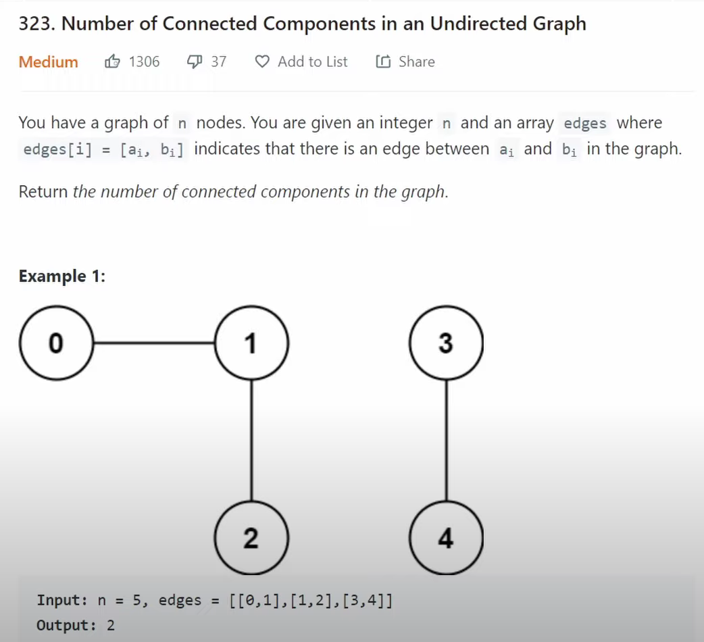

# Graphs

## [Number of Islands](https://leetcode.com/problems/number-of-islands)

A: DFS，第一次登岛时ans++。

```cpp
class Solution {
public:
    int numIslands(vector<vector<char>>& grid) {
        int ans = 0;
        int m = grid.size(), n = grid[0].size();
        for (int row = 0; row < m; row++) {
            for (int col = 0; col < n; col++) {
                dfs(grid, ans, row, col, m, n, true);
            }
        }
        return ans;
    }
private:
    void dfs(vector<vector<char>>& grid, int &ans, int i, int j, int m, int n, bool isRoot) {
        if (i < 0 || i >= m || j < 0 || j >= n || grid[i][j] == '0') {
            return;
        }

        grid[i][j] = '0';
        dfs(grid, ans, i+1, j, m, n, false);
        dfs(grid, ans, i, j+1, m, n, false);
        dfs(grid, ans, i-1, j, m, n, false);
        dfs(grid, ans, i, j-1, m, n, false);
        if (isRoot) ans++;
    }
};
```

```go
func numIslands(grid [][]byte) int {
    var ans int
    m, n := len(grid), len(grid[0])
    for i := 0; i < m; i++ {
        for j := 0; j < n; j++ {
            if grid[i][j] == '1' {
                ans++
                dfs(grid, i, j, m, n)
            }
        }
    }
    return ans
}

func dfs(grid [][]byte, i, j, m, n int) {
    if i < 0 || i >= m || j < 0 || j >= n || grid[i][j] != '1' {
        return
    }
    grid[i][j] = 'v'
    dfs(grid, i - 1, j, m, n)
    dfs(grid, i, j - 1, m, n)
    dfs(grid, i + 1, j, m, n)
    dfs(grid, i, j + 1, m, n)
}
```

## [Clone Graph](https://leetcode.com/problems/clone-graph)

A: DFS，哈希表存放结点状态。

```cpp
/*
// Definition for a Node.
class Node {
public:
    int val;
    vector<Node*> neighbors;
    Node() {
        val = 0;
        neighbors = vector<Node*>();
    }
    Node(int _val) {
        val = _val;
        neighbors = vector<Node*>();
    }
    Node(int _val, vector<Node*> _neighbors) {
        val = _val;
        neighbors = _neighbors;
    }
};
*/

class Solution {
public:
    Node* cloneGraph(Node* node) {
        unordered_map<int, Node*>nodes;

        return dfs(node, nodes);
    }

private:
    Node* dfs(Node* node, unordered_map<int, Node*> &nodes) {
        if (!node)  return nullptr;
        if (nodes.find(node->val) != nodes.end()) {
            return nodes[node->val];
        }

        Node* cNode = new Node(node->val);
        nodes[node->val] = cNode;

        for (auto n : node->neighbors) {
            cNode->neighbors.push_back(dfs(n, nodes));
        }

        return cNode;
    }
};
```

```go
/**
 * Definition for a Node.
 * type Node struct {
 *     Val int
 *     Neighbors []*Node
 * }
 */

func cloneGraph(node *Node) *Node {
    m := map[int]*Node{}
    return dfs(node, m)
}

func dfs(node *Node, m map[int]*Node) *Node {
    if node == nil {
        return nil
    }
    if n, ok := m[node.Val]; ok {
        return n
    }
    ans := &Node{Val: node.Val}
    m[node.Val] = ans
    for _, n := range node.Neighbors {
        cn := dfs(n, m)
        ans.Neighbors = append(ans.Neighbors, cn)
    }
    return ans
}
```

## [Pacific Atlantic Water Flow](https://leetcode.com/problems/pacific-atlantic-water-flow)

A: 从边界（海洋）开始反向DFS，寻找能到达单一海洋的集合，取交集。

```cpp
class Solution {
public:
    vector<vector<int>> pacificAtlantic(vector<vector<int>>& heights) {
        int m = heights.size();
        int n = heights[0].size();
        
        vector<vector<bool>> pacific(m, vector<bool>(n));
        vector<vector<bool>> atlantic(m, vector<bool>(n));
        
        for (int i = 0; i < m; i++) {
            dfs(heights, pacific, i, 0, m, n);
            dfs(heights, atlantic, i, n - 1, m, n);
        }
        
        for (int j = 0; j < n; j++) {
            dfs(heights, pacific, 0, j, m, n);
            dfs(heights, atlantic, m - 1, j, m, n);
        }
        
        vector<vector<int>> result;
        
        for (int i = 0; i < m; i++) {
            for (int j = 0; j < n; j++) {
                if (pacific[i][j] && atlantic[i][j]) {
                    result.push_back({i, j});
                }
            }
        }
        
        return result;
    }
private:
    void dfs(vector<vector<int>>& heights, vector<vector<bool>>& visited,
        int i, int j, int m, int n) {
        
        visited[i][j] = true;
        
        if (i > 0 && !visited[i - 1][j] && heights[i - 1][j] >= heights[i][j]) {
            dfs(heights, visited, i - 1, j, m, n);
        }
        if (i < m - 1 && !visited[i + 1][j] && heights[i + 1][j] >= heights[i][j]) {
            dfs(heights, visited, i + 1, j, m, n);
        }
        if (j > 0 && !visited[i][j - 1] && heights[i][j - 1] >= heights[i][j]) {
            dfs(heights, visited, i, j - 1, m, n);
        }
        if (j < n - 1 && !visited[i][j + 1] && heights[i][j + 1] >= heights[i][j]) {
            dfs(heights, visited, i, j + 1, m, n);
        }
    }
};
```

## [Course Schedule](https://leetcode.com/problems/course-schedule)

A: DFS查找有向图中是否存在循环。

```cpp
class Solution {
public:
    bool canFinish(int numCourses, vector<vector<int>>& prerequisites) {
        // map each course to prereq list
        unordered_map<int, vector<int>> m;
        for (int i = 0; i < prerequisites.size(); i++) {
            m[prerequisites[i][0]].push_back(prerequisites[i][1]);
        }
        // all courses along current DFS path
        unordered_set<int> visited;
        
        for (int course = 0; course < numCourses; course++) {
            if (!dfs(course, m, visited)) {
                return false;
            }
        }
        return true;
    }
private:
    bool dfs(int course, unordered_map<int, vector<int>>& m, unordered_set<int>& visited) {
        if (visited.find(course) != visited.end()) {
            return false;
        }
        if (m[course].empty()) {
            return true;
        }
        visited.insert(course);
        for (int i = 0; i < m[course].size(); i++) {
            int nextCourse = m[course][i];
            if (!dfs(nextCourse, m, visited)) {
                return false;
            }
        }
        // 减少后续dfs开销
        m[course].clear();
        
        visited.erase(course);
        return true;
    }
};
```

```go
var (
    visited map[int]struct{}
    cur map[int]bool
    adj map[int][]int

)

func canFinish(numCourses int, prerequisites [][]int) bool {
    visited = map[int]struct{}{}
    adj = map[int][]int{}
    cur = map[int]bool{}
    for _, p := range prerequisites {
        if _, ok := adj[p[0]]; !ok {
            adj[p[0]] = []int{}
        }
        adj[p[0]] = append(adj[p[0]], p[1])
    }
    for i := 0; i < numCourses; i++ {
        if !dfs(i) {
            return false
        }
    }
    return true
}

func dfs(i int) bool {
    if cur[i] {
        return false
    }
    if _, ok := visited[i]; ok {
        return true
    }
    if len(adj[i]) == 0 {
        return true
    }
    visited[i] = struct{}{}
    cur[i] = true
    for _, nxt := range adj[i] {
        if !dfs(nxt) {
            return false
        }
    }
    cur[i] = false
    return true
}
```

## Number of Connected Components In An Undirected Graph



A: 并查集。

```cpp
class Solution {
public:
    int countComponents(int n, vector<vector<int>>& edges) {
        vector<int> parents;
        vector<int> ranks;
        for (int i = 0; i < n; i++) {
            parents.push_back(i);
            ranks.push_back(1);
        }
        
        int result = n;
        for (int i = 0; i < edges.size(); i++) {
            int n1 = edges[i][0];
            int n2 = edges[i][1];
            result -= doUnion(parents, ranks, n1, n2);
        }
        return result;
    }
private:
    int doFind(vector<int>& parents, int n) {
        int p = parents[n];

        // 找到所在集合的parent
        while (p != parents[p]) {
            parents[p] = parents[parents[p]];
            p = parents[p];
        }
        return p;
    }
    
    int doUnion(vector<int>& parents, vector<int>& ranks, int n1, int n2) {
        int p1 = doFind(parents, n1);
        int p2 = doFind(parents, n2);

        // 同一集合无需合并
        if (p1 == p2) {
            return 0;
        }
        

        // 合并两个集合
        if (ranks[p1] > ranks[p2]) {
            parents[p2] = p1;
            ranks[p1] += ranks[p2];
        } else {
            parents[p1] = p2;
            ranks[p2] += ranks[p1];
        }
        
        return 1;
    }
};
```

## [Graph Valid Tree](https://www.lintcode.com/problem/178)

A: DFS，检查（1）是否全部遍历（2）是否存在环。

```cpp
class Solution {
public:
    bool validTree(int n, vector<vector<int>>& edges) {
        vector<vector<int>> adj(n);
        for (int i = 0; i < edges.size(); i++) {
            vector<int> edge = edges[i];
            adj[edge[0]].push_back(edge[1]);
            adj[edge[1]].push_back(edge[0]);
        }
        
        vector<bool> visited(n);
        if (hasCycle(adj, visited, -1, 0)) {
            return false;
        }
        
        for (int i = 0; i < visited.size(); i++) {
            if (!visited[i]) {
                return false;
            }
        }
        return true;
    }
private:
    bool hasCycle(vector<vector<int>>& adj, vector<bool>& visited, int parent, int child) {
        if (visited[child]) {
            return true;
        }
        visited[child] = true;
        // checking for cycles and connectedness
        for (int i = 0; i < adj[child].size(); i++) {
            int curr = adj[child][i];
            if (curr != parent && hasCycle(adj, visited, child, curr)) {
                return true;
            }
        }
        return false;
    }
};
```

## [All Paths From Source to Target](https://leetcode.com/problems/all-paths-from-source-to-target)

A: DFS + 回溯。

```cpp
class Solution {
public:
    void dfs(vector<vector<int>>&ans, vector<int>&path, int n, int source, vector<vector<int>> &graph) {
        if(source == n-1) {
            ans.push_back(path);
            return;
        }
        
        for(int x : graph[source]) {
            path.push_back(x);
            dfs(ans, path, n, x, graph);
            path.pop_back();
        }
    }
    vector<vector<int>> allPathsSourceTarget(vector<vector<int>>& graph) {
        vector<vector<int>> ans;
        vector<int> path;
        path.push_back(0);
        int n = graph.size();
        dfs(ans, path, n, 0, graph);
        return ans;
    }
};
```

```go
var (
    ans [][]int
    cur []int
)

func allPathsSourceTarget(graph [][]int) [][]int {
    ans = [][]int{}
    cur = []int{0}
    dfs(graph, 0, len(graph) - 1)
    return ans
}

func dfs(graph [][]int, start, end int) {
    if start == end {
        tmp := make([]int, len(cur))
        copy(tmp, cur)
        ans = append(ans, tmp)
    }
    if len(graph[start]) == 0 {
        return
    }
    for _, to := range graph[start] {
        cur = append(cur, to)
        dfs(graph, to, end)
        cur = cur[:len(cur) - 1]
    }
}
```

## [Max Area of Island](https://leetcode.com/problems/max-area-of-island)

A: 递归函数直接返回当前岛屿面积。

```cpp
class Solution {
public:
    int maxAreaOfIsland(vector<vector<int>>& grid) {
        int m = grid.size();
        int n = grid[0].size();
        
        int result = 0;
        
        for (int i = 0; i < m; i++) {
            for (int j = 0; j < n; j++) {
                if (grid[i][j] == 1) {
                    result = max(result, dfs(grid, i, j, m, n));
                }
            }
        }
        
        return result;
    }
private:
    int dfs(vector<vector<int>>& grid, int i, int j, int m, int n) {
        if (i < 0 || i >= m || j < 0 || j >= n || grid[i][j] == 0) {
            return 0;
        }
        grid[i][j] = 0;
        
        return 1 + dfs(grid, i - 1, j, m, n) + dfs(grid, i + 1, j, m, n)
            + dfs(grid, i, j - 1, m, n) + dfs(grid, i, j + 1, m, n);
    }
};
```

## [Surrounded Regions](https://leetcode.com/problems/surrounded-regions)

A: 从边界搜索岛屿，给予特殊标记。

```cpp
class Solution {
public:
    void solve(vector<vector<char>>& board) {
        int m = board.size();
        int n = board[0].size();
        
        // marking escaped cells along the border
        for (int i = 0; i < m; i++) {
            dfs(board,i,0,m,n);
            dfs(board,i,n-1,m,n);
        }
        
        for (int j = 0; j < n; j++) {
            dfs(board,0,j,m,n);
            dfs(board,m-1,j,m,n);
        }
        
        // flip cells to correct final states
        for (int i = 0; i < m; i++) {
            for (int j = 0; j < n; j++) {
                if (board[i][j] == 'O') {
                    board[i][j] = 'X';
                }
                if (board[i][j] == 'E') {
                    board[i][j] = 'O';
                }
            }
        }
    }
private:
    void dfs(vector<vector<char>>& board, int i, int j, int m, int n) {
        if (i < 0 || i >= m || j < 0 || j >= n || board[i][j] != 'O') {
            return;
        }
        
        board[i][j] = 'E';
        
        dfs(board, i - 1, j, m, n);
        dfs(board, i + 1, j, m, n);
        dfs(board, i, j - 1, m, n);
        dfs(board, i, j + 1, m, n);
    }
};
```

A: 并查集，边界为O的元素根结点为dummy，其余O元素与其相邻的O元素合并，最后遍历所有元素，若元素与dummy相连，则为O，否则为X。

```go
var (
    parent []int
)

func solve(board [][]byte)  {
    m, n := len(board), len(board[0])
    parent = make([]int, m * n + 1)
    for i := range parent {
        parent[i] = i
    }
    dummy := m * n

    for i := 0; i < m; i++ {
        if board[i][0] == 'O' {
            union(i * n, dummy)
        }
        if board[i][n - 1] == 'O' {
            union(i * n + n - 1, dummy)
        }
    }

    for j := 0; j < n; j++ {
        if board[0][j] == 'O' {
            union(j, dummy)
        }
        if board[m - 1][j] == 'O' {
            union(n * (m - 1) + j, dummy)
        }
    }

    d := [][]int{{0, 1}, {1, 0}, {0, -1}, {-1, 0}}
    for i := 1; i < m - 1; i++ {
        for j := 1; j < n - 1; j++ {
            for k := 0; k < 4; k++ {
                if board[i][j] == 'X' {
                    continue
                }
                x := i + d[k][0]
                y := j + d[k][1]
                if board[x][y] == 'O' {
                    union(i * n + j, x * n + y)
                }
            }
        }
    }

    for i := 1; i < m - 1; i++ {
        for j := 1; j < n - 1; j++ {
            if board[i][j] != 'O' {
                continue
            }
            if !connected(dummy, i * n + j) {
                board[i][j] = 'X'
            }
        }
    }
}

func union(n1, n2 int) {
    p1, p2 := find(n1), find(n2)
    if p1 == p2 {
        return
    } else {
        parent[p1] = p2
    }
}

func find(n int) int {
    if n != parent[n] {
        parent[n] = find(parent[n])
    }
    return parent[n]
}

func connected(n1, n2 int) bool {
    p1, p2 := find(n1), find(n2)
    return p1 == p2
}
```

## [Rotting Oranges](https://leetcode.com/problems/rotting-oranges)

A: BFS，用队列存储腐烂橘子，记录同一时刻腐烂橘子个数。

```cpp
class Solution {
public:
    int orangesRotting(vector<vector<int>>& grid) {
        vector<int> dir = {-1, 0, 1, 0, -1}; //used for finding all 4 adjacent coordinates
        
        int m=grid.size();
        int n=grid[0].size();
        
        queue<pair<int,int>> q;
        int fresh=0; //To keep track of all fresh oranges left
        for (int i = 0;i<m;i++)
            for (int j=0;j<n;j++) {
                if(grid[i][j]==2)
                    q.push({i,j});
                if(grid[i][j]==1)
                    fresh++;
            }
        int ans=-1; //initialised to -1 since after each step we increment the time by 1 and initially all rotten oranges started at 0.
        while(!q.empty()) {
            int sz=q.size(); // 同一时刻腐烂橘子个数，全部出队列后时间流逝
            while(sz--) {
                pair<int,int> p=q.front();
                q.pop();
                for(int i=0;i<4;i++)
                {
                    // BFS，腐烂邻近橘子
                    int r=p.first+dir[i];
                    int c=p.second+dir[i+1];
                    if(r>=0 && r<m && c>=0 && c<n && grid[r][c]==1)
                    {
                        grid[r][c]=2;
                        q.push({r,c});
                        fresh--; // decrement by 1 foreach fresh orange that now is rotten
                    }
                    
                }
            }
            ans++; //incremented after each minute passes
        }
        if(fresh>0) return -1; //if fresh>0 that means there are fresh oranges left
        if(ans==-1) return 0; //we initialised with -1, so if there were no oranges it'd take 0 mins.
        return ans;
        
    }
};
```

```go
func orangesRotting(grid [][]int) int {
    var q [][]int
    m, n := len(grid), len(grid[0])
    var cnt int
    for i := 0; i < m; i++ {
        for j := 0; j < n; j++ {
            if grid[i][j] == 1 {
                cnt++
            }
            if grid[i][j] == 2 {
                q = append(q, []int{i, j})
            }
        }
    }
    if cnt == 0 {
        return 0
    }
    var time int
    for len(q) > 0 {
        for _, o := range q {
            x, y := o[0], o[1]
            q = q[1:]
            for _, dir := range [][]int{{0, 1}, {0, -1}, {1, 0}, {-1, 0}} {
                nextX, nextY := x + dir[0], y + dir[1]
                if nextX < 0 || nextX >= m || nextY < 0 || nextY >= n || grid[nextX][nextY] != 1 {
                    continue
                }
                grid[nextX][nextY] = 2
                cnt--
                q = append(q, []int{nextX, nextY})
            }
        }
        time++
    }
    if cnt == 0 {
        return time - 1
    }
    return -1
}
```

## [Walls And Gates](https://www.lintcode.com/problem/663)

A: 从门开始执行BFS，更新最短距离。

```cpp
class Solution {
public:
    const int INF = 2147483647;
    vector<int> dir = {-1, 0, 1, 0, -1};
    void wallsAndGates(vector<vector<int>> &rooms) {
        int m = rooms.size(), n = rooms[0].size();
        std::queue<pair<int, int>> dq;
        for (int i = 0; i < m; i++) {
            for (int j = 0; j < n; j++) {
                if (rooms[i][j] == 0) {
                    dq.push({i, j});
                }
            }
        }
        while (!dq.empty()) {
            int len = dq.size();
            while (len--) {
                pair<int, int> room = dq.front();
                dq.pop();
                for (int i = 0; i < 4; i++) {
                    int row = room.first + dir[i];
                    int col = room.second + dir[i + 1];
                    if (row >= 0 && row < m && col >= 0 && col < n) {
                        if (rooms[row][col] == -1 || rooms[row][col] == 0) continue;
                        else {
                            if (rooms[row][col] > rooms[room.first][room.second] + 1) {
                                dq.push({row, col});
                                rooms[row][col] = rooms[room.first][room.second] + 1;
                            }
                        }
                    }
                }
            }
        }
    }
};
```

## [Course Schedule II](https://leetcode.com/problems/course-schedule-ii)

A: **拓扑排序**，通过dfs寻找叶子结点，回溯加入visited(前置课程实际上为子节点)。

```cpp
class Solution {
public:
    vector<int> findOrder(int numCourses, vector<vector<int>>& prerequisites) {
        unordered_map<int, vector<int>> m;
        // build adjacency list of prereqs
        for (int i = 0; i < prerequisites.size(); i++) {
            m[prerequisites[i][0]].push_back(prerequisites[i][1]);
        }
        unordered_set<int> visit;
        unordered_set<int> cycle;
        
        vector<int> result;
        for (int course = 0; course < numCourses; course++) {
            if (!dfs(course, m, visit, cycle, result)) {
                return {};
            }
        }
        return result;
    }
private:
    // a course has 3 possible states:
    // visited -> course added to result
    // visiting -> course not added to result, but added to cycle
    // unvisited -> course not added to result or cycle
    bool dfs(int course, unordered_map<int, vector<int>>& m, unordered_set<int>& visit,
        unordered_set<int>& cycle, vector<int>& result) {
        
        if (cycle.find(course) != cycle.end()) {
            return false;
        }
        if (visit.find(course) != visit.end()) {
            return true;
        }
        cycle.insert(course);
        for (int i = 0; i < m[course].size(); i++) {
            int nextCourse = m[course][i];
            if (!dfs(nextCourse, m, visit, cycle, result)) {
                return false;
            }
        }
        cycle.erase(course);
        visit.insert(course);
        result.push_back(course);
        return true;
    }
};
```

```go
var (
    visited map[int]struct{}
    cur map[int]bool
    adj map[int][]int
    ans []int
)

func findOrder(numCourses int, prerequisites [][]int) []int {
    visited = map[int]struct{}{}
    adj = map[int][]int{}
    cur = map[int]bool{}
    ans = []int{}
    for _, p := range prerequisites {
        if _, ok := adj[p[0]]; !ok {
            adj[p[0]] = []int{}
        }
        adj[p[0]] = append(adj[p[0]], p[1])
    }
    for i := 0; i < numCourses; i++ {
        if !dfs(i) {
            return []int{}
        }
    }
    return ans
}

func dfs(i int) bool {
    if cur[i] {
        return false
    }
    if _, ok := visited[i]; ok {
        return true
    }
    if len(adj[i]) == 0 {
        if _, ok := visited[i]; !ok {
            ans = append(ans, i)
        }
        visited[i] = struct{}{}
        return true
    }
    visited[i] = struct{}{}
    cur[i] = true
    for _, nxt := range adj[i] {
        if !dfs(nxt) {
            return false
        }
    }
    cur[i] = false
    ans = append(ans, i)
    return true
}
```

## [Redundant Connection](https://leetcode.com/problems/redundant-connection)

A: 并查集找最小生成树。

```cpp
class Solution {
public:
    vector<int> findRedundantConnection(vector<vector<int>>& edges) {
        int n = edges.size();
        
        vector<int> parents;
        vector<int> ranks;
        for (int i = 0; i < n + 1; i++) {
            parents.push_back(i);
            ranks.push_back(1);
            
        }
        
        vector<int> result;
        for (int i = 0; i < n; i++) {
            int n1 = edges[i][0];
            int n2 = edges[i][1];
            if (!doUnion(parents, ranks, n1, n2)) {
                result = {n1, n2};
                break;
            }
        }
        return result;
    }
private:
    int doFind(vector<int>& parents, int n) {
        int p = parents[n];
        while (p != parents[p]) {
            parents[p] = parents[parents[p]];
            p = parents[p];
        }
        return p;
    }
    
    bool doUnion(vector<int>& parents, vector<int>& ranks, int n1, int n2) {
        int p1 = doFind(parents, n1);
        int p2 = doFind(parents, n2);
        if (p1 == p2) {
            return false;
        }
        
        if (ranks[p1] > ranks[p2]) {
            parents[p2] = p1;
            ranks[p1] += ranks[p2];
        } else {
            parents[p1] = p2;
            ranks[p2] += ranks[p1];
        }
        
        return true;
    }
};
```

```go
var (
    parent []int
    rank []int
)
func findRedundantConnection(edges [][]int) []int {
    n := len(edges)
    parent = make([]int, n + 1)
    rank = make([]int, n + 1)
    for i := 0; i <= n; i++ {
        rank[i] = 1
        parent[i] = i
    }
    for _, e := range edges {
        if !union(e[0], e[1]) {
            return e
        }
    }
    return []int{-1, -1}
}

func union(n1, n2 int) bool {
    p1 := find(n1)
    p2 := find(n2)

    if p1 == p2 {
        return false
    } else {
        if rank[p1] > rank[p2] {
            parent[p2] = p1
            rank[p1] += rank[p2]
        } else {
            parent[p1] = p2
            rank[p2] += rank[p1]
        }
    }
    return true
}

func find(n int) int {
    p := parent[n]
    for p != parent[p] {
        parent[n] = parent[parent[n]]
        p = parent[n]
    }
    return p
}
```

## [Redundant Connection II](https://leetcode.com/problems/redundant-connection-ii)

A: 分为两种情况：1）有一个节点入度为2，那么这个节点的两个入边中，检查去掉哪条边可以生成树。2）没有节点入度为2，那么这个图一定是有环的，类似于[Redundant Connection](https://leetcode.com/problems/redundant-connection)的解法。

```go
var (
	n      = 1010// 节点数量3 到 1000
	father = make([]int, n)
)

// 并查集初始化
func initialize() {
	for i := 0; i < n; i++ {
		father[i] = i
	}
}

// 并查集里寻根的过程
func find(u int) int {
	if u == father[u] {
		return u
	}
	father[u] = find(father[u])
	return father[u]
}

// 将v->u 这条边加入并查集
func join(u, v int) {
	u = find(u)
	v = find(v)
	if u == v {
		return
	}
	father[v] = u
}

// 判断 u 和 v是否找到同一个根，本题用不上
func same(u, v int) bool {
	u = find(u)
	v = find(v)
	return u == v
}

// getRemoveEdge 在有向图里找到删除的那条边，使其变成树
func getRemoveEdge(edges [][]int) []int {
	initialize()
	for i := 0; i < len(edges); i++ { // 遍历所有的边
		if same(edges[i][0], edges[i][1]) { // 构成有向环了，就是要删除的边
			return edges[i]
		}
		join(edges[i][0], edges[i][1])
	}
	return []int{}
}

// isTreeAfterRemoveEdge 删一条边之后判断是不是树
func isTreeAfterRemoveEdge(edges [][]int, deleteEdge int) bool {
	initialize()
	for i := 0; i < len(edges); i++ {
		if i == deleteEdge {
			continue
		}
		if same(edges[i][0], edges[i][1]) { // 构成有向环了，一定不是树
			return false
		}
		join(edges[i][0], edges[i][1])
	}
	return true
}

func findRedundantDirectedConnection(edges [][]int) []int {
	inDegree := make([]int, len(father))
	for i := 0; i < len(edges); i++ {
		// 统计入度
		inDegree[edges[i][1]] += 1
	}
	// 记录入度为2的边（如果有的话就两条边）
	// 找入度为2的节点所对应的边，注意要倒序，因为优先返回最后出现在二维数组中的答案
	twoDegree := make([]int, 0)
	for i := len(edges) - 1; i >= 0; i-- {
		if inDegree[edges[i][1]] == 2 {
			twoDegree = append(twoDegree, i)
		}
	}

	// 处理图中情况1 和 情况2
	// 如果有入度为2的节点，那么一定是两条边里删一个，看删哪个可以构成树
	if len(twoDegree) > 0 {
		if isTreeAfterRemoveEdge(edges, twoDegree[0]) {
			return edges[twoDegree[0]]
		}
		return edges[twoDegree[1]]
	}

	// 处理图中情况3
 	// 明确没有入度为2的情况，那么一定有有向环，找到构成环的边返回就可以了
	return getRemoveEdge(edges)
}
```

## [Word Ladder](https://leetcode.com/problems/word-ladder)

A: BFS寻找最短路径。

```cpp
class Solution {
public:
    int ladderLength(string beginWord, string endWord, vector<string>& wordList) {
        unordered_set<string> dict;
        for (int i = 0; i < wordList.size(); i++) {
            dict.insert(wordList[i]);
        }
        
        queue<string> q;
        q.push(beginWord);
        
        int result = 1;
        
        while (!q.empty()) {
            int count = q.size();
            
            for (int i = 0; i < count; i++) {
                string word = q.front();
                q.pop();
                
                if (word == endWord) {
                    return result;
                }
                dict.erase(word);
                
                for (int j = 0; j < word.size(); j++) {
                    char c = word[j];
                    for (int k = 0; k < 26; k++) {
                        word[j] = k + 'a';
                        if (dict.find(word) != dict.end()) {
                            q.push(word);
                            dict.erase(word);
                        }
                        word[j] = c;
                    }
                }
            }
            
            result++;
        }
        
        return 0;
    }
};
```

```go
func ladderLength(beginWord string, endWord string, wordList []string) int {
    m := map[string]struct{}{}
    for _, w := range wordList {
        m[w] = struct{}{}
    }

    q := []string{beginWord}
    ans := 1
    for len(q) > 0 {
        for i := len(q); i > 0; i-- {
            cur := q[0]
            q = q[1:]
            if cur == endWord {
                return ans
            }
            for i := 0; i < len(cur); i++ {
                for j := 0; j < 26; j++ {
                    bts := []byte(cur)
                    bts[i] = byte(int('a') + j)
                    s := string(bts)
                    if _, ok := m[s]; ok {
                        q = append(q, s)
                        delete(m, s)
                    }
                }
            }
        }
        ans++
    }
    return 0
}
```

## [Count Sub Islands](https://leetcode.com/problems/count-sub-islands)

A: DFS，用与运算标定两张格网中同时为1的元素。

```cpp
class Solution {
public:
        int countSubIslands(vector<vector<int>>& B, vector<vector<int>>& A) {
        int m = A.size(), n = A[0].size(), res = 0;
        for (int i = 0; i < m; i++)
            for (int j = 0; j < n; j++)
                if (A[i][j] == 1)
                    res += dfs(B, A, i, j);
        return res;
    }

    int dfs(vector<vector<int>>& B, vector<vector<int>>& A, int i, int j) {
        int m = A.size(), n = A[0].size(), res = 1;
        if (i < 0 || i == m || j < 0 || j == n || A[i][j] == 0) return 1;
        A[i][j] = 0;
        res &= dfs(B, A, i - 1, j);
        res &= dfs(B, A, i + 1, j);
        res &= dfs(B, A, i, j - 1);
        res &= dfs(B, A, i, j + 1);
        return res & B[i][j];
    }
};
```

## [Reorder Routes to Make All Paths Lead to The City Zero](https://leetcode.com/problems/reorder-routes-to-make-all-paths-lead-to-the-city-zero)

A: 将边视作双向（用负数指代实际不存在的边），dfs，实际上无法到达则ans++。

```cpp
class Solution {
public:
    int dfs(vector<vector<int>> &al, vector<bool> &visited, int from) {
        auto change = 0;
        visited[from] = true;
        for (auto to : al[from])
            if (!visited[abs(to)])
                change += dfs(al, visited, abs(to)) + (to > 0);
        return change;        
    }
    int minReorder(int n, vector<vector<int>>& connections) {
        vector<vector<int>> al(n);
        for (auto &c : connections) {
            al[c[0]].push_back(c[1]);
            al[c[1]].push_back(-c[0]); // 负号表示实际不存在
        }
        return dfs(al, vector<bool>(n) = {}, 0);
    }
};
```

```go
var (
    adj map[int][]int
)

func minReorder(n int, connections [][]int) int {
    adj = map[int][]int{}
    for _, c := range connections {
        if adj[c[0]] == nil {
            adj[c[0]] = []int{}
        }
        if adj[c[1]] == nil {
            adj[c[1]] = []int{}
        }
        adj[c[0]] = append(adj[c[0]], c[1])
        adj[c[1]] = append(adj[c[1]], -c[0])
    }
    visited := map[int]struct{}{}
    return dfs(visited, 0)
}

func dfs(visited map[int]struct{}, from int) int {
    if _, ok := visited[from]; ok {
        return 0
    }
    visited[from] = struct{}{}
    changes := 0
    for _, e := range adj[from] {
        if _, ok := visited[e]; !ok {
            if e > 0 {
                changes++
                changes += dfs(visited, e)
            } else {
                changes += dfs(visited, -e)
            }
        }
    }
    return changes
}
```

## [Snakes And Ladders](https://leetcode.com/problems/snakes-and-ladders)

A: BFS。

```cpp
class Solution {
public:
    int snakesAndLadders(vector<vector<int>>& board) {
        int n=board.size();
        vector<int> vis((n*n)+1,0);
        int ans=0;
        queue<int> q;
        q.push(1);
        vis[1]=1;
        while(!q.empty())
        {
            ans++;
            int t=q.size();
            while(t--)
            {
                int curr=q.front();
                q.pop();
                for(int i=curr+1; i<=curr+6  ;i++)
                {
                        if(i==n*n) return ans;
                        int x=n-ceil(1.0*i/n*1.0);
                        int y=0;
                        if(n%2==0)
                            y=(x%2!=0?(i-1)%n : n-(i-1)%n-1);
                        else
                            y=(x%2!=0)?( n-(i-1)%n-1 ):(i-1)%n;
                    
                        int dest= board[x][y]!=-1?board[x][y]:i;
                    
                        if(dest==n*n) return ans;
                        if(vis[dest]==0)
                        {
                           q.push(dest);
                            vis[dest]=1;
                        }                      
                    
                }
                
            }
         
        }
         return -1;
    }
};
```

## [Open The Lock](https://leetcode.com/problems/open-the-lock)

A: BFS。

```cpp
class Solution {
public:
    int openLock(vector<string>& deadends, string target) {
        unordered_set<string> s;
        for (auto &d : deadends) {
            s.insert(d);
        }
        if (s.find("0000") != s.end()) return -1;
        if (target == "0000") return 0;
        queue<string> q;
        q.push("0000");
        int ans = 0;
        while (!q.empty()) {
            ans++;
            int len = q.size();
            while (len--) {
                string cur = q.front();
                q.pop();
                for (int i = 0; i < 4; i++) {
                    string in = increase(cur, i);
                    string de = decrease(cur, i);
                    if (in == target || de == target) {
                        return ans;
                    }
                    if (s.find(in) == s.end()) {
                        s.insert(in);
                        q.push(in);
                    }
                    if (s.find(de) == s.end()) {
                        s.insert(de);
                        q.push(de);
                    }
                }
            }
        }
        return -1;
    }
private:
    string increase(string cur, int i) {
        string ans = cur;
        if (ans[i] == '9') {
            ans[i] = '0';
        } else {
            ans[i]++;
        }
        return ans;
    }
    
    string decrease(string cur, int i) {
        string ans = cur;
        if (ans[i] == '0') {
            ans[i] = '9';
        } else {
            ans[i]--;
        }
        return ans;
    }
};
```

```go
func openLock(deadends []string, target string) int {
    s := map[string]struct{}{}
    for i := range deadends {
        s[deadends[i]] = struct{}{}
    }
    q := []string{"0000"}
    ans := 0
    if target == "0000" {
        return ans
    }
    for len(q) > 0 {
        ans++
        for i := len(q); i > 0; i-- {
            cur := q[0]
            q = q[1:]
            if _, ok := s[cur]; ok {
                continue
            }
            s[cur] = struct{}{}
            for j := 0; j < 4; j++ {
                s1 := increase(cur, j)
                s2 := decrease(cur, j)

                if _, ok := s[s1]; !ok {
                    q = append(q, s1)
                }
                if _, ok := s[s2]; !ok {
                    q = append(q, s2)
                }
                if s1 == target || s2 == target {
                    return ans
                }
            }
        }
    }
    return -1
}

func increase(s string, i int) string {
    bt := []byte(s)
    if bt[i] == '9' {
        bt[i] = '0'
    } else {
        bt[i]++
    }
    return string(bt)
}

func decrease(s string, i int) string {
    bt := []byte(s)
    if bt[i] == '0' {
        bt[i] = '9'
    } else {
        bt[i]--
    }
    return string(bt)
}
```

## [Find Eventual Safe States](https://leetcode.com/problems/find-eventual-safe-states)

A: 不在环中的结点为目标节点。

```cpp
class Solution {
public:
    using vvi = vector<vector<int>>;
    using usi = unordered_set<int>;

    usi cycle_nodes;
    usi safe_nodes;

    bool dfs (const vvi& g, int i, usi visited_nodes) 
    {    
        if (safe_nodes.find (i)  != safe_nodes.end ())  return true;  // we know safe already
        if (cycle_nodes.find (i) != cycle_nodes.end ()) return false; // we know in cycle already

        if (visited_nodes.find (i) != visited_nodes.end ()) {         // we have determined node is in cycle
            cycle_nodes.insert (i);
            return false;
        }

        visited_nodes.insert (i); // keep track of nodes we've visited already

        for (int node : g[i]) {
            if (!dfs (g, node, visited_nodes)) {
                cycle_nodes.insert (i); // if child is in cycle, parent must be too
                return false;
            }
        }

        safe_nodes.insert (i); // we know node is safe now

        return true;
    }

    vector<int> eventualSafeNodes(vvi& graph) 
    {
        vector<int> ans;
        usi visited_nodes;

        for (int i = 0; i < graph.size (); i++) {
            if (dfs (graph, i, visited_nodes)) ans.push_back (i);
        }

        return ans;
    }
};
```

## [Find the Town Judge](https://leetcode.com/problems/find-the-town-judge)

A: 统计入度出度，差值为n-1的为目标。

```cpp
int findJudge(int N, vector<vector<int>>& trust) {
    vector<int> count(N + 1, 0);
    for (auto& t : trust)
        count[t[0]]--, count[t[1]]++;
    for (int i = 1; i <= N; ++i) {
        if (count[i] == N - 1) return i;
    }
    return -1;
}
```

## [Find Closest Node to Given Two Nodes](https://leetcode.com/problems/find-closest-node-to-given-two-nodes)

A: BFS，分别记录两个节点历史路径以确定答案。

```cpp
class Solution {
public:
    int closestMeetingNode(vector<int>& edges, int node1, int node2) {
        vector<bool> dist1(edges.size(), 0);
        vector<bool> dist2(edges.size(), 0);
        queue<int> q1;
        queue<int> q2;
        q1.push(node1);
        q2.push(node2);
        while (!q1.empty() || !q2.empty()) {
            int res1 = bfs(q1, edges, dist1, dist2);
            int res2 = bfs(q2, edges, dist2, dist1);
            cout << res1 << ", " << res2 << endl;
            if (res1 != -1 && res2 != -1) return min(res1, res2);
            if (res1 != -1) return res1;
            if (res2 != -1) return res2;
        }
        return -1;
    }
private:
    int bfs(queue<int> &q, vector<int> &edges, vector<bool> &dist1, vector<bool> &dist2) {
        if (q.empty()) return -1;
        int n = q.front();
        q.pop();
        if (dist2[n] == 1) {
            return n;
        } else {
            dist1[n] = 1;
            if (edges[n] != -1 && dist1[edges[n]] == 0) {
                q.push(edges[n]);
            }
            return -1;
        }
    }
};
```

## [Check if Move is Legal](https://leetcode.com/problems/check-if-move-is-legal)

A: 分八个方向依次按条件进行DFS。

```cpp
class Solution {
public:
    bool checkMove(vector<vector<char>>& board, int rMove, int cMove, char color) {
        vector<pair<int, int>> dirs = {{0, 1}, {0, -1}, {1, 0}, {-1, 0}, {1, 1}, {1, -1}, {-1, 1}, {-1, -1}};
        for (auto &dir : dirs) {
            int r = rMove + dir.first, c = cMove + dir.second;
            if (r < 0 || r == 8 || c < 0 || c == 8 || board[r][c] == '.' || board[r][c] == color) continue;
            if (dfs(board, r + dir.first, c + dir.second, color, dir)) return true;
        }
        return false;
    }
private:
    bool dfs(vector<vector<char>> &board, int r, int c, char color, pair<int, int> &dir) {
        if (r < 0 || r == 8 || c < 0 || c == 8 || board[r][c] == '.') {
            return false;
        }
        if (board[r][c] == color) {
            return true;
        }
        return dfs(board, r+dir.first, c+dir.second, color, dir);
    }
};
```

## [Shortest Bridge](https://leetcode.com/problems/shortest-bridge)

A: 首先DFS找到一个岛屿，以该岛屿边界为起点用BFS寻找下一个岛屿。即可得到最短路径。

```cpp
class Solution {
    vector<vector<int> > mat;
    vector<vector<int> > vis;
    int m,n;
    int x[4]={-1,0,1,0};
    int y[4]={0,1,0,-1};
    queue<pair<int,int> > que;
public:
    void dfs(int i,int j){
        vis[i][j]=1;
        que.push({i,j});
        for(int dir=0;dir<4;dir++){
            int xd=i+x[dir];
            int yd=j+y[dir];
            if(xd>=0 && yd>=0 && xd<=m-1 && yd<=n-1){
                if(!vis[xd][yd] && mat[xd][yd]==1){
                    dfs(xd,yd);
                }
            }
        }
    }
    int shortestBridge(vector<vector<int>>& A) {
        m=A.size();
        if(m==0) return 0;
        n=A[0].size();
        cout<<m<<" "<<n;
        mat=A;
        vis.resize(m,vector<int>(n,0));
        int flag=0;
        for(int i=0;i<m;i++){
            for(int j=0;j<n;j++){
                if(mat[i][j]==1){
                    dfs(i,j);
                    flag=1;
                    break;
                }
            }
            if(flag){
                break;
            }
        }
        int l=0;
        while(!que.empty()){
            int len=que.size();
            l++;
            while(len--){
                pair<int,int> poi=que.front();
                que.pop();
                vis[poi.first][poi.second]=1;
                for(int dir=0;dir<4;dir++){
                    int xd=poi.first+x[dir];
                    int yd=poi.second+y[dir];
                    if(xd>=0 && yd>=0 && xd<=m-1 && yd<=n-1){
                       if(!vis[xd][yd] && mat[xd][yd]==1){
                           return l-1;
                       }
                       else if(!vis[xd][yd] && mat[xd][yd]==0){
                           vis[xd][yd]=1;
                           que.push({xd,yd});
                       }
                    }
                }
            }
        }
        return -1;
    }
};
```

## [Minimum Number of Days to Eat N Oranges](https://leetcode.com/problems/minimum-number-of-days-to-eat-n-oranges)

A: DP。

```cpp
class Solution {
public:
    unordered_map<int, int> dp;
    int minDays(int n) {
        if (n <= 1)
            return n;
        if (dp.count(n) == 0)
            dp[n] = 1 + min(n % 2 + minDays(n / 2), n % 3 + minDays(n / 3));
        return dp[n];
    }
};
```

## [Island Perimeter](https://leetcode.com/problems/island-perimeter)

A: DFS。

```cpp
class Solution {
public:
    int islandPerimeter(vector<vector<int>>& grid) {
        int ans = 0;
        int m = grid.size(), n = grid[0].size();
        for (int i = 0; i < m; i++) {
            for (int j = 0; j < n; j++) {
                if (grid[i][j] == 1)
                    dfs(ans, grid, m, n, i, j);
            }
        }
        return ans;
    }
private:
    void dfs(int &ans, vector<vector<int>>& grid, int m, int n, int i, int j) {
        if (i < 0 || i == m || j < 0 || j == n || grid[i][j] == 0) {
            ans++;
            return;
        }
        if (grid[i][j] == -1) return;
        grid[i][j] = -1;
        dfs(ans, grid, m, n, i + 1, j);
        dfs(ans, grid, m, n, i - 1, j);
        dfs(ans, grid, m, n, i, j + 1);
        dfs(ans, grid, m, n, i, j - 1);
    }
};
```

A: 只有当当前格子为1时，才需要计算周长，因此只需要遍历所有的1，然后计算每个1的周长即可。

```go
func islandPerimeter(grid [][]int) int {
    m, n := len(grid), len(grid[0])
    res := 0
    for i := 0; i < m; i++ {
        for j := 0; j < n; j++ {
            if grid[i][j] == 1 {
                res += 4
                // 上下左右四个方向
                if i > 0 && grid[i-1][j] == 1 {res--} // 上边有岛屿
                if i < m-1 && grid[i+1][j] == 1 {res--} // 下边有岛屿
                if j > 0 && grid[i][j-1] == 1 {res--} // 左边有岛屿
                if j < n-1 && grid[i][j+1] == 1 {res--} // 右边有岛屿
            }
        }
    }
    return res
}
```

## [Verifying an Alien Dictionary](https://leetcode.com/problems/verifying-an-alien-dictionary)

A: 将新的顺序还原成我们常用的字母顺序，然后判断是否排序。

```cpp
class Solution {
public:
    bool isAlienSorted(vector<string> words, string order) {
        int mapping[26];
        for (int i = 0; i < 26; i++)
            mapping[order[i] - 'a'] = i;
        for (string &w : words)
            for (char &c : w)
                c = mapping[c - 'a'];
        return is_sorted(words.begin(), words.end());
    }
};
```

## [Shortest Path in Binary Matrix](https://leetcode.com/problems/shortest-path-in-binary-matrix)

A: BFS，计算最短路径问题。

```cpp
class Solution {
public:
    int shortestPathBinaryMatrix(vector<vector<int>>& g, int steps = 0) {
      queue<pair<int, int>> q;
      q.push({ 0, 0 });
      while (!q.empty()) {
        ++steps;
        queue<pair<int, int>> q1;
        while (!q.empty()) {
          auto c = q.front();
          q.pop();
          if (exchange(g[c.first][c.second], 1) == 1) continue; // exchange: Replaces the value of obj with new_value and returns the old value of obj.
          if (c.first == g.size() - 1 && c.second == g.size() - 1) return steps;
          for (auto i = c.first - 1; i <= c.first + 1; ++i)
            for (auto j = c.second - 1; j <= c.second + 1; ++j)
              if (i != c.first || j != c.second) {
                if (i >= 0 && j >= 0 && i < g.size() && j < g.size() && !g[i][j]) {
                  q1.push({ i, j });
                }
              }
        }
        swap(q, q1);
      }
      return -1;
    }
};
```

A: BFS，但直接在原数组上记录步数，不需要额外的空间。

```go
type node struct {
    x, y int
}

func shortestPathBinaryMatrix(grid [][]int) int {
    q := []node{node{x: 0, y: 0}}
    if grid[0][0] != 0 || grid[len(grid) - 1][len(grid[0]) - 1] != 0 {
        return -1
    }
    grid[0][0] = 1
    for len(q) > 0 {
        cur := q[0]
        q = q[1:]
        if cur.x == len(grid) - 1 && cur.y == len(grid[0]) - 1 {
            return grid[cur.x][cur.y]
        }
        for i := cur.x - 1; i <= cur.x + 1; i++ {
            for j := cur.y - 1; j <= cur.y + 1; j++ {
                if i >= 0 && i < len(grid) && j >= 0 && j < len(grid[0]) {
                    if grid[i][j] == 0 {
                        grid[i][j] = grid[cur.x][cur.y] + 1
                        q = append(q, node{i, j})
                    }
                }
            }
        }
    }
    return -1
}
```

## [As Far from Land as Possible](https://leetcode.com/problems/as-far-from-land-as-possible)

A: BFS，将所有陆地入队，然后从陆地开始向四周扩散，直到遇到海洋。直到最远的陆地都扩散完，就是最远距离。

```go
func maxDistance(grid [][]int) int {
    var m int = len(grid)
    var n int = len(grid[0])
    Queue := [][]int{}
    for i := 0; i < m; i++ {
        for j := 0; j < n; j++ {
            if grid[i][j] == 1 {
                Queue = append(Queue, []int{i, j})
            }
        }
    }
    if len(Queue) == m * n {return -1}
    var ans int = -1
    dirs := [][]int{{-1, 0}, {1, 0}, {0, -1}, {0, 1}}
    for len(Queue) > 0 {
        ans++
        var s int = len(Queue)
        for i := 0; i < s; i++ {
            curr := Queue[0]
            Queue = Queue[1: len(Queue)]
            for _, dir := range dirs {
                var x int = curr[0] + dir[0]
                var y int = curr[1] + dir[1]
                if x >= 0 && y >= 0 && x < m && y < n && grid[x][y] == 0 {
                    grid[x][y] = 1
                    Queue = append(Queue, []int{x, y})
                }
            }
        }
    }
    return ans
}
```

## [Shortest Path with Alternating Colors](https://leetcode.com/problems/shortest-path-with-alternating-colors)

A: BFS，v1、v2分别存储两种颜色下各个结点的访问情况。

```cpp

class Solution {
public:
    vector<int> shortestAlternatingPaths(int n, vector<vector<int>>& red_edges, vector<vector<int>>& blue_edges){

        vector<int> res(n, -1), v1(n, 0), v2(n, 0);
        vector<vector<pair<int, int>>> vp(n); // pair<to, color>
        queue<pair<int, int>> q;

        for(auto &it : red_edges) vp[it[0]].push_back({it[1], 1});
        for(auto &it : blue_edges) vp[it[0]].push_back({it[1], 2});

        res[0] = 0; // 初始位置
        v1[0] = 1;
        v2[0] = 1;
        int temp = 1;

        for(auto &it : vp[0])
        {
            q.push(it);
            if(res[it.first] == -1) res[it.first] = temp;
        }

        while(!q.empty())
        {
            int len = q.size();
            temp++;
            for(int i=0; i<len; ++i)
            {
                auto val = q.front();
                q.pop();
                if(val.second == 1) v1[val.first] = 1;
                else v2[val.first] = 1;

                for(auto &it : vp[val.first])
                {
                    // 跳过相同颜色路径
                    if(val.second == 1 && (v2[it.first] || it.second==1)) continue;
                    if(val.second == 2 && (v1[it.first] || it.second==2)) continue;
                    q.push(it);                      
                    if(res[it.first] == -1) res[it.first] = temp;
                }
            }
        }
        return res;
    }
};
```

## [Minimum Fuel Cost to Report to the Capital](https://leetcode.com/problems/minimum-fuel-cost-to-report-to-the-capital)

A: 

```cpp
class Solution {
 public:
  long long minimumFuelCost(vector<vector<int>>& roads, int seats) {
    long long ans = 0;
    vector<vector<int>> graph(roads.size() + 1);

    for (const vector<int>& road : roads) {
      const int u = road[0];
      const int v = road[1];
      graph[u].push_back(v);
      graph[v].push_back(u);
    }

    dfs(graph, 0, -1, seats, ans);
    return ans;
  }

 private:
  int dfs(const vector<vector<int>>& graph, int u, int prev, int seats,
          long long& ans) {
    int people = 1;
    for (const int v : graph[u]) {
      if (v == prev)
        continue;
      people += dfs(graph, v, u, seats, ans);
    }
    if (u > 0)
      // # of cars needed = ceil(people / seats)
      ans += (people + seats - 1) / seats;
    return people;
  }
};
```

```go
func minimumFuelCost(roads [][]int, seats int) int64 {
    var ans int64 = 0
    adj := make(map[int][]int)
    // initialize the adjacency list
    for _, v := range roads {
        if _, ok := adj[v[0]]; !ok {
            adj[v[0]] = make([]int, 0)
        }
        if _, ok := adj[v[1]]; !ok {
            adj[v[1]] = make([]int, 0)
        }
        adj[v[0]] = append(adj[v[0]], v[1])
        adj[v[1]] = append(adj[v[1]], v[0])
    }
    dfs(int64(seats), adj, &ans, 0, -1)
    return ans
}

// minimum cost at node cur
func dfs(seats int64, adj map[int][]int, ans *int64, cur, pre int) int64 {
    var load int64 = 1 // how much representatives we have at the cur node
    for _, node := range adj[cur] {
        if node == pre {
            // we only traverse children of the cur node
            continue
        }
        load += dfs(seats, adj, ans, node, cur)
    }
    if cur != 0 {
        // if cur is not the root, we need to add the cost of the car
        // ceil(load / seats)
        *ans += (load + seats - 1) / seats
    }
    return load
}
```

## [Jump Game IV](https://leetcode.com/problems/jump-game-iv)

A: BFS，当相同的数字已经被访问过之后，就可以不再访问，以此剪枝。

```go
func minJumps(arr []int) int {
    // ht: key is the number, value is the index of the number
	ht:=make(map[int][]int)
	for i:=range arr{
		if ht[arr[i]]==nil{
			ht[arr[i]] = make([]int, 0)
		}
		ht[arr[i]] = append(ht[arr[i]], i)
	}
    // numVisited: key is the number, value is whether the number has been visited
	numVisited:=make(map[int]bool)

	queue:=make([]int, 1)
	queue[0] = 0
	step:=0
    // visited: key is the index, value is whether the index has been visited
	visited :=make([]bool, len(arr))
	visited[0] = true
	for len(queue)>0{
		size:=len(queue)
		for i:=0; i<size;i++{
			cur:=queue[i]
			if cur==len(arr)-1{
				return step
			}
			/* if the current number has been visited, then all the same number are already in queue */
			if !numVisited[arr[cur]]{
				numVisited[arr[cur]] = true
				for _, j:=range ht[arr[cur]]{
					if j==cur {
						continue
					}
					queue = append(queue, j)
					visited[j] = true
				}
			}
			if cur -1 >= 0 && !visited[cur-1]{
				queue = append(queue, cur-1)
				visited[cur-1] = true
			}
			if cur+1 <len(arr) && !visited[cur+1]{
				queue = append(queue, cur+1)
				visited[cur+1] = true
			}
		}
		queue = queue[size:]
		step++
	}
	return -1
}
```

## [Course Schedule IV](https://leetcode.com/problems/course-schedule-iv)

A: 建立邻接表，然后用 DFS 检查是否存在路径。

```go
func checkIfPrerequisite(n int, prerequisites [][]int, queries [][]int) []bool {
	adjList := make([][]int, n)

	for i := 0; i < len(adjList); i++ {
		adjList[i] = []int{}
	}

	for _, v := range prerequisites {
		x, y := v[0], v[1]
		adjList[x] = append(adjList[x], y)
	}

	results := []bool{}

	for _, v := range queries {
		x, y := v[0], v[1]
	    seen := make([]int, n)
        results = append(results, checkCourse(x, y, &adjList, &seen))
	}

	return results
}

func checkCourse(x int, y int, adjList *[][]int, seen *[]int) bool {
	(*seen)[x] = 1
	
	if x == y {
		return true
	}

	for _, v := range (*adjList)[x] {
        if (*seen)[v] == 0 {
            if checkCourse(v, y, adjList, seen) {
                return true
            }
        }
	}

	return false
}
```

## [Accounts Merge](https://leetcode.com/problems/accounts-merge)

A: 并查集，先将所有的邮箱都合并，然后再将合并后的邮箱和对应的账户进行映射。

```go
func accountsMerge(accounts [][]string) [][]string {
    parent := make([]int, len(accounts))
    rank := make([]int, len(accounts))
    for i := range rank {
        parent[i] = i
        rank[i] = 1
    }
    
    // use index as account, O(1)
    var find = func(account int) int {
        p := parent[account]
        
        for p != parent[p] {
            parent[p] = parent[parent[p]]
            p = parent[p]
        }
        
        return p
    }
    
	// O(1)
    var union = func(account1, account2 int) bool {
        p1, p2 := find(account1), find(account2)
        if p1 == p2 {
            return false
        }
        
        if rank[p1] >= rank[p2] {
            parent[p2] = p1
            rank[p1] += rank[p2]
        } else {
            parent[p1] = p2
            rank[p2] += rank[p1]
        }
        
        return true
    }
    
	// O(len(accounts) * len(accounts[i]))
    emails := map[string]int{}
    for i, account := range accounts {
        for j:= 1; j<len(account); j++ {
            email := account[j]
            
            if _, ok := emails[email]; !ok {
                emails[email] = i    
            } else {
                union(i, emails[email])   
            }
        }
    }
    
    mergedAccounts := map[int][]string{} // name: [email]
    for email, account := range emails {
        p := find(account)
        if _, ok := mergedAccounts[p]; !ok {
            mergedAccounts[p] = []string{accounts[p][0]}
        }
        mergedAccounts[p] = append(mergedAccounts[p], email)
    }
    
    res := [][]string{}
    for _, account := range mergedAccounts {
		// O(nlogn)
        sort.Slice(account[1:], func(i, j int) bool {
            return account[1:][i] < account[1:][j]
        })
        res = append(res, account)
    }
    
    return res
}
```

## [Minimum Score of a Path Between Two Cities](https://leetcode.com/problems/minimum-score-of-a-path-between-two-cities)

A: BFS，寻找1到n的连通图中的最短边。

```go
type pair struct {
    first int
    second int
}

func minScore(n int, roads [][]int) int {
    adjList := make([][]pair, n + 1)
    for _, edge := range roads {
        adjList[edge[0]] = append(adjList[edge[0]], pair{edge[1], edge[2]})
        adjList[edge[1]] = append(adjList[edge[1]], pair{edge[0], edge[2]})
    }
    visited := make([]bool, n + 1)
    Queue := []int{1}
    var ans int = math.MaxInt
    for len(Queue) > 0 {
        var sz int = len(Queue)
        for i := 0; i < sz; i++ {
            var curr int = Queue[0]
            Queue = Queue[1:]
            for _, edge := range adjList[curr] {
                if edge.second < ans {
                    ans = edge.second
                }
                if !visited[edge.first] {
                    Queue = append(Queue, edge.first)
                    visited[edge.first] = true
                }
            }
        }
    }
    return ans
}
```

## [Number of Operations to Make Network Connected](https://leetcode.com/problems/number-of-operations-to-make-network-connected)

A: 并查集。

```go
func find(x int, parent []int) int {
	if x != parent[x] {
		parent[x] = find(parent[x], parent)
	}
	return parent[x]
}

func union(a int, b int, parent []int) {
	a = find(a, parent)
	b = find(b, parent)
	parent[b] = a
}

func same(a int, b int, parent []int) bool {
	return find(a, parent) == find(b, parent)
}

func makeConnected(n int, connections [][]int) int {
	cableNum := len(connections)
	parent := make([]int, n)
	group := n
	if cableNum < n-1 {
		return -1
	}
	//initialize
	for i := 0; i < n; i++ {
		parent[i] = i
	}
	//union find
	for i := 0; i < cableNum; i++ {
		if !same(connections[i][0], connections[i][1], parent) {
			union(connections[i][0], connections[i][1], parent)
			group--
		}
	}
	return group - 1
}
```

## [Count Unreachable Pairs of Nodes in an Undirected Graph](https://leetcode.com/problems/count-unreachable-pairs-of-nodes-in-an-undirected-graph)

A: DFS。

```go
func countPairs(n int, edges [][]int) int64 {
    visited := make([]bool, n)
    adj := map[int][]int{}
    for _, e := range edges {
        if adj[e[0]] == nil {
            adj[e[0]] = []int{}
        }
        if adj[e[1]] == nil {
            adj[e[1]] = []int{}
        }
        adj[e[0]] = append(adj[e[0]], e[1])
        adj[e[1]] = append(adj[e[1]], e[0])
    }
    groups := []int64{}
    for i := 0; i < n; i++ {
        if !visited[i] {
            num := dfs(i, visited, adj)
            groups = append(groups, int64(num))
        }
    }
    if len(groups) == 1 {
        return 0
    }
    var ans int64
    for i := 0; i < len(groups); i++ {
        for j := i + 1; j < len(groups); j++ {
            ans += groups[i] * groups[j]
        }
    }
    return ans
}

func dfs(i int, visited []bool, adj map[int][]int) int {
    nums := 1
    visited[i] = true
    for _, to := range adj[i] {
        if !visited[to] {
            nums += dfs(to, visited, adj)
        }
    }
    return nums
}
```

## [Longest Cycle in a Graph](https://leetcode.com/problems/longest-cycle-in-a-graph)

A: DFS。

```go
func longestCycle(edges []int) int {
	n := len(edges)
	times := make([]int, n) // times[i] is the time when node i is visited
	visited := func(i int) bool {
		return times[i] > 0
	}
	t := 1
	res := -1
	for i := range edges {
		t0 := t
		if visited(i) {
			continue
		}
		times[i] = t
		t++
		// Iterate until end or reaching a previously visited node
		first, second := i, edges[i]
		for second != -1 && !visited(second) {
			times[second] = t
			first = second
			second = edges[second]
			t++
		}
		if second != -1 && times[second] >= t0 {
			res = max(res, times[first]-times[second]+1)
		}
	}
	return res
}

func max(a, b int) int {
	if a > b {
		return a
	}
	return b
}
```

## [Number of Closed Islands](https://leetcode.com/problems/number-of-closed-islands)

A: DFS，注意四个方向布尔值的判断，必须要确保计算每个方向上的dfs，即dfs在flag之前。

```go
func closedIsland(grid [][]int) int {
    m, n := len(grid), len(grid[0])
    ans := 0
    for i := 0; i < m; i++ {
        for j := 0; j < n; j++ {
            if grid[i][j] == 0 {
                if dfs(grid, i , j, m, n) {
                    ans++
                }
            }
        }
    }
    return ans
}

func dfs(grid [][]int, i, j, m, n int) bool {
    if i < 0 || i >= m || j < 0 || j >= n {
        return false
    }
    if grid[i][j] == -1 || grid[i][j] == 1 {
        return true
    }
    grid[i][j] = -1
    flag := true
    flag = dfs(grid, i, j + 1, m, n) && flag
    flag = dfs(grid, i, j - 1, m, n) && flag
    flag = dfs(grid, i + 1, j, m, n) && flag
    flag = dfs(grid, i - 1, j, m, n) && flag
    return flag
}
```

## [Number of Enclaves](https://leetcode.com/problems/number-of-enclaves)

A: DFS。

```go
func numEnclaves(grid [][]int) int {
    m, n := len(grid), len(grid[0])
    ans := 0
    for i := 0; i < m; i++ {
        for j := 0; j < n; j++ {
            if grid[i][j] != -1 {
                if ok, area := dfs(grid, m, n, i, j); ok {
                    ans += area
                }
            }
        }
    }
    return ans
}

func dfs(grid [][]int, m, n, i, j int) (bool, int) {
    if i < 0 || i >= m || j < 0 || j >= n {
        return false, 0
    }
    if grid[i][j] == -1 || grid[i][j] == 0 {
        return true, 0
    }
    grid[i][j] = -1
    area := 1
    flag := true
    f, a := dfs(grid, m, n, i + 1, j)
    flag = flag && f
    area += a
    f, a = dfs(grid, m, n, i - 1, j)
    flag = flag && f
    area += a
    f, a = dfs(grid, m, n, i, j + 1)
    flag = flag && f
    area += a
    f, a = dfs(grid, m, n, i, j - 1)
    flag = flag && f
    area += a
    return flag, area
}
```

## [Keys and Rooms](https://leetcode.com/problems/keys-and-rooms)

A: DFS。

```go
func canVisitAllRooms(rooms [][]int) bool {
    n := len(rooms)
    visited := map[int]struct{}{}
    return dfs(0, n, rooms, visited)
}

func dfs(cur, n int, rooms [][]int, visited map[int]struct{}) bool {
    if _, ok := visited[cur]; ok {
        return false
    }
    visited[cur] = struct{}{}
    if n == len(visited) {
        return true
    }
    ans := false
    for _, r := range rooms[cur] {
        ans = dfs(r, n, rooms, visited) || ans
    }
    return ans
}
```

## [Is Graph Bipartite?](https://leetcode.com/problems/is-graph-bipartite)

A: 遍历并染色，如果已经遍历，则检测颜色是否符合二分图条件。

```go
var (
    color []bool
    visited []bool
)

func isBipartite(graph [][]int) bool {
    color = make([]bool, len(graph))
    visited = make([]bool, len(graph))
    for i := 0; i < len(graph); i++ {
        if !dfs(graph, i) {
            return false
        }
    }
    return true
}

func dfs(graph [][]int, cur int) bool {
    if visited[cur] {
        return true
    }
    visited[cur] = true
    for i := 0; i < len(graph[cur]); i++ {
        nxt := graph[cur][i]
        if visited[nxt] {
            if color[nxt] == color[cur] {
                return false
            }
        } else {
            color[nxt] = !color[cur]
            if !dfs(graph, nxt) {
                return false
            }
        }
    }
    return true
}
```

## [Possible Bipartition](https://leetcode.com/problems/possible-bipartition)

A: 构建邻接表，再判断是否是二分图。

```go
var (
    color []bool
    visited []bool
    graph [][]int
)

func possibleBipartition(n int, dislikes [][]int) bool {
    graph = make([][]int, n + 1)
    for i := 0; i < n + 1; i++ {
        graph[i] = []int{}
    }
    for _, e := range dislikes {
        from, to := e[0], e[1]
        graph[from] = append(graph[from], to)
        graph[to] = append(graph[to], from)
    }
    color = make([]bool, len(graph))
    visited = make([]bool, len(graph))
    for i := 0; i < len(graph); i++ {
        if !dfs(graph, i) {
            return false
        }
    }
    return true
}

func dfs(graph [][]int, cur int) bool {
    if visited[cur] {
        return true
    }
    visited[cur] = true
    for i := 0; i < len(graph[cur]); i++ {
        nxt := graph[cur][i]
        if visited[nxt] {
            if color[nxt] == color[cur] {
                return false
            }
        } else {
            color[nxt] = !color[cur]
            if !dfs(graph, nxt) {
                return false
            }
        }
    }
    return true
}
```

## [Graph Valid Tree](https://www.lintcode.com/problem/178/)

A: 并查集，首先判断是否有环，其次判断最后的连通分量是否为1。

```go
var (
    parent []int
    cnt int
)

func ValidTree(n int, edges [][]int) bool {
    // write your code here
    parent = make([]int, n)
    cnt = n
    for i := range parent {
        parent[i] = i
    }
    for _, e := range edges {
        if !connected(e[0], e[1]) {
            union(e[0], e[1])
        } else {
            return false
        }
    }
    return cnt == 1
}

func union(n1, n2 int) {
    p1, p2 := find(n1), find(n2)
    if p1 == p2 {
        return
    }
    cnt--
    parent[p1] = p2
}

func find(n1 int) int {
    if n1 != parent[n1] {
        parent[n1] = find(parent[n1])
    }
    return parent[n1]
}

func connected(n1, n2 int) bool {
    return find(n1) == find(n2)
}
```

## [Evaluate Division](https://leetcode.com/problems/evaluate-division/)

A: 构建双向图，然后DFS。

```go
func dfs(x, y string, visited map[string]bool, g map[string]map[string]float64) float64{
    // 1. if x or y is not in the graph return -1
        _, okX := g[x]
        _, okY := g[y]
        if !okX || ! okY {
            return -1.0
        }
    // 2. if len of x edges is 0; return -1  
        if len(g[x]) == 0 {
            return -1.0
        }
    // 3. if y in x return the result
        val, okResult := g[x][y] 
        if okResult {
            return val
        }
    // 4. do dfs now, and multiply the product if answer is not -1 (which means it is not in the path of query)
        for k, _ := range g[x]{
            if !visited[k]{
                visited[k] = true
                tmp := dfs(k, y, visited, g)
                if tmp == -1.0 {
                    continue
                } else {
                    return tmp * g[x][k]
                }
            }
        }
        return -1.0
}

func calcEquation(equations [][]string, values []float64, queries [][]string) []float64 {
    // 1. let's build the graph
    g := make(map[string]map[string]float64)
    for i, v := range equations {
        if g[v[0]] == nil {
            g[v[0]] = make(map[string]float64)
        }
        if g[v[1]] == nil {
            g[v[1]] = make(map[string]float64)
        }
        g[v[0]][v[1]] = values[i]
        g[v[1]][v[0]] = 1 / values[i]
    }
       
    results := make([]float64, 0, len(queries))
    // 2. answer queries
    for _, v := range queries {
        x := v[0]
        y := v[1]
        v := make(map[string]bool)
        result := dfs(x, y, v, g)
        results = append(results, result)
    }
    return results
}
```

## [Detonate the Maximum Number of Bombs](https://leetcode.com/problems/detonate-the-maximum-number-of-bombs/)

A: 将炸弹引爆关系转换成图，然后DFS。

```go
var (
    adj [][]int
    visited []bool
    ans int
)

func maximumDetonation(bombs [][]int) int {
    adj = make([][]int, len(bombs))
    ans = 0
    for i := range adj {
        adj[i] = []int{}
    }
    for i := range bombs {
        r := bombs[i][2] * bombs[i][2]
        for j := range bombs {
            if i == j {
                continue
            }
            dist := pow2(bombs[i][0] - bombs[j][0]) + pow2(bombs[i][1] - bombs[j][1])
            if dist <= r {
                adj[i] = append(adj[i], j)
            }
        }
    }
    for i := range bombs {
        visited = make([]bool, len(bombs))
        ans = max(dfs(bombs, i), ans)
    }
    return ans
}

func dfs(bombs [][]int, idx int) int {
    if visited[idx] {
        return 0
    }
    nums := 1
    visited[idx] = true
    for _, i := range adj[idx] {
        nums += dfs(bombs, i)
    }
    return nums
}

func max(i, j int) int {
    if i < j {
        return j
    } else {
        return i
    }
}

func pow2(i int) int {
    return i * i
}
```

## [Number of Provinces](https://leetcode.com/problems/number-of-provinces/)

A: 并查集，成功联通则总数减一。

```cpp
class Solution {
public:
    int findCircleNum(vector<vector<int>>& isConnected) {
        int num = isConnected.size();
        vector<int> rank, parent;
        for (int i = 0; i < num; i++) {
            parent.push_back(i);
            rank.push_back(1);
        }
        int ans = num;
        for (int i = 0; i < num; i++) {
            for (int j = 0; j < num; j++) {
                if (i==j) continue;
                if (isConnected[i][j]) {
                    ans -= doUnion(i, j, rank, parent);
                }
            }
        }
        return ans;
    }
private:
    int doFind(int i, vector<int> &parent) {
        int p = parent[i];

        while(p != parent[p]) {
            parent[p] = parent[parent[p]];
            p = parent[p];
        }

        return p;
    }

    int doUnion(int i, int j, vector<int> &rank, vector<int> &parent) {
        int p1 = doFind(i, parent);
        int p2 = doFind(j, parent);

        if (p1 == p2)   return 0;

        if (rank[p1] >= rank[p2]) {
            rank[p1] += rank[p2];
            parent[p2] = p1;
        } else {
            rank[p2] += rank[p1];
            parent[p1] = p2;
        }
        return 1;
    }
};
```

```go
var (
    parent []int
    rank []int
)

func findCircleNum(isConnected [][]int) int {
    n := len(isConnected)
    parent = make([]int, n)
    rank = make([]int, n)
    for i := range parent {
        parent[i] = i
        rank[i] = 1
    }
    ans := n
    for i := range isConnected {
        for j := range isConnected[i] {
            if i == j {
                continue
            }
            if isConnected[i][j] == 1 {
                if union(i, j) {
                    ans --
                }
            }
        }
    }
    return ans
}

func union(i, j int) bool {
    p1, p2 := find(i), find(j)
    if p1 == p2 {
        return false
    }
    if rank[p1] > rank[p2] {
        parent[p2] = p1
        rank[p1] += rank[p2]
    } else {
        parent[p1] = p2
        rank[p2] += rank[p1]
    }
    return true
}

func find(i int) int {
    for i != parent[i] {
        parent[i] = parent[parent[i]]
        i = parent[i]
    }
    return i
}
```
